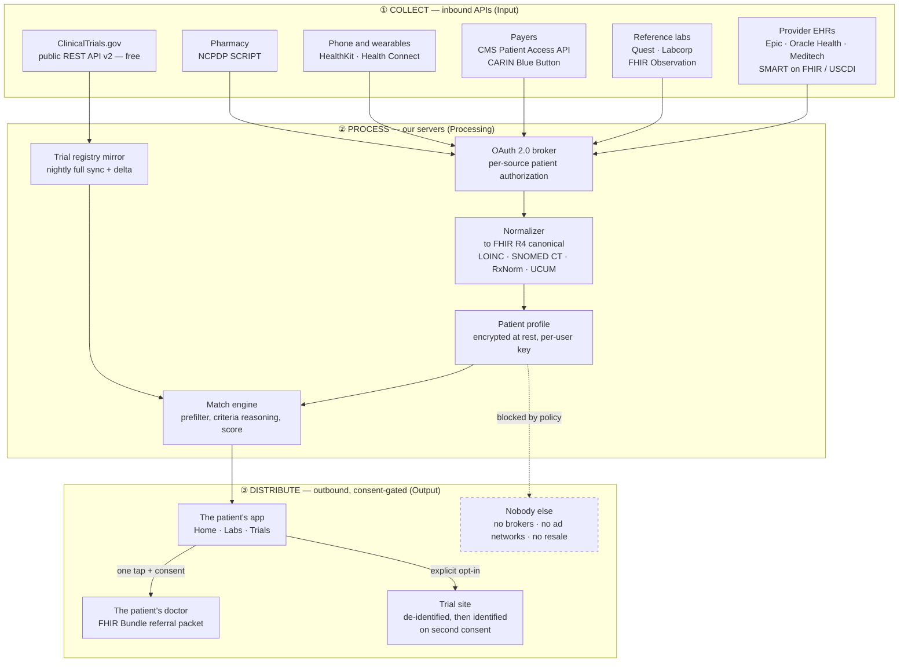
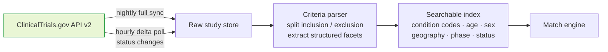
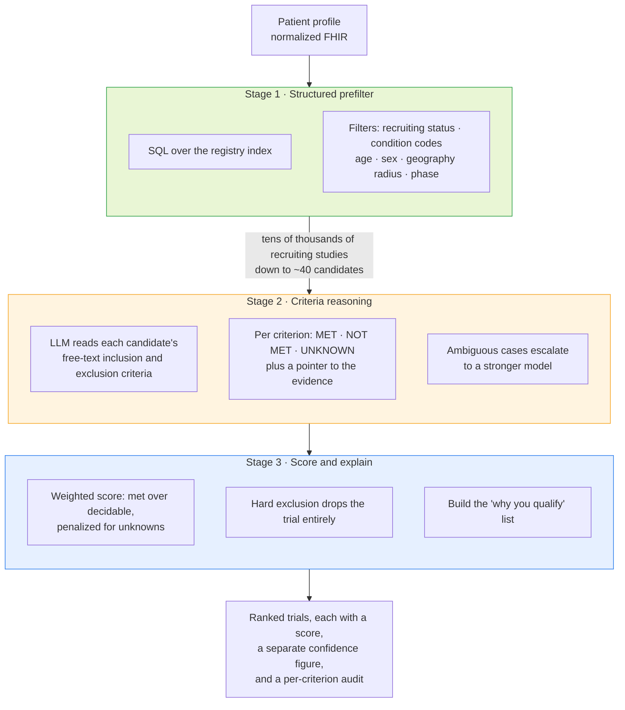
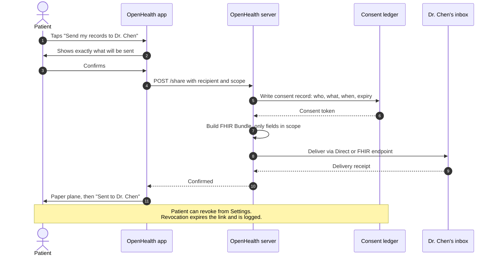
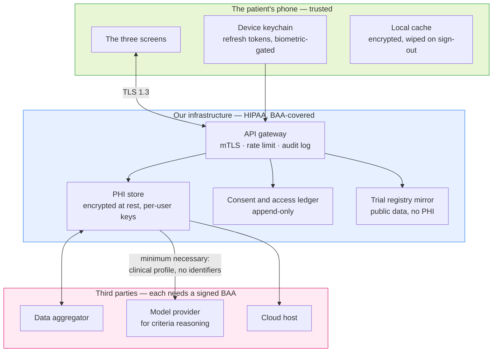

# OpenHealth — Data Flow Architecture

> **How OpenHealth collects data from APIs, processes it, and distributes it.**
>
> This describes the **real deployment** — the system the prototype is a picture of. That
> framing is no longer entirely true: as of 2026-10-06 the prototype implements the
> normalization, parsing, evaluation and scoring layers for real, over real data, from two
> real input rails. What it does *not* implement is the aggregation layer and the delivery
> layer, both of which are contracts problems rather than code problems. §8 says which is
> which, row by row.
>
> Read this doc as "what the wires would be," `SIMPLIFY.md` as "what is actually being
> built," and `BRIEF.md` as "what the screens show."
>
> Diagrams are Mermaid and render on GitHub.

---

## 1 · The whole system at a glance

Three bands, matching the class I→P→O requirement: **collect** (Input), **normalize +
match** (Processing), **distribute** (Output).



---

## 2 · The collection layer, source by source

Every row is an API that exists today. The **who pays** column is the reason the cost model
in [`COSTS.md`](COSTS.md) looks the way it does.

| Source | Standard / protocol | What we pull | Feeds screen | Who pays |
|--------|--------------------|--------------|--------------|----------|
| **Provider EHR** (Epic, Oracle Health, Meditech) | SMART on FHIR + OAuth 2.0, USCDI v3 | `Observation` (labs), `Condition`, `MedicationRequest`, `AllergyIntolerance`, `CareTeam`, `Procedure` | 1 · 2 · 3 | Read-only USCDI APIs are **free to the developer**; the health system holds the subscription |
| **Reference labs** (Quest, Labcorp) | FHIR `Observation`, legacy HL7v2 feeds | Ferritin, CBC, lipid panel, metabolic panel | 2 | Per-transaction, or bundled via an aggregator |
| **Payers** | CMS Interoperability and Patient Access API, CARIN Blue Button | `Coverage`, `ExplanationOfBenefit` | 1 (insurance row) | Federally mandated — free to the patient's app |
| **Phone and wearables** | Apple HealthKit, Android Health Connect, **Garmin Health API** | SpO₂, resting heart rate, HRV, activity, sleep, body composition | 2 | Free and on-device for HealthKit / Health Connect. Garmin requires partner-program approval, OAuth 1.0a request signing, and a webhook endpoint you host — see the prototype note below |
| **Pharmacy** | NCPDP SCRIPT / Surescripts | Active medication list | 3 (exclusion criteria) | Per-transaction network fee |
| **ClinicalTrials.gov** | Public REST API v2 | Every registered study plus full eligibility-criteria text | 3 | **Free. No API key, no signup.** ~50 req/min per IP — which is exactly why we mirror it |
| **Aggregator** (1upHealth, Health Gorilla, Metriport) | One API in front of thousands of endpoints | All of the above, pre-normalized | all | Per-member-per-month — the single largest line item |

### The prototype's two rails, and why they are not this table

Everything above needs contracts, OAuth, or a server. The prototype has none of those and is
not allowed to acquire them, so it reaches the same **data shapes** by two routes that need
neither — see [`SIMPLIFY.md`](SIMPLIFY.md) §5:

| Real-deployment row | Prototype substitute | Why it is equivalent where it matters |
|---|---|---|
| Provider EHR / reference labs | **Documents → `Tesseract.js` OCR → `parseLabDocument()`**, in-browser | Produces the same normalized `Observation` shape with the same LOINC code. The source of the text differs; the resource does not |
| Wearables | **A local `python-garminconnect` script that commits `garmin.json`**, which the app reads as a static file | The operator's own real Garmin data, refreshed every few days. A build-time pipeline, **not a backend** — nothing listens on a port, and no credential is ever shipped to the client |

Both rails are keyless by construction, which is the constraint in
[`STACK.md`](STACK.md) §6a. Neither is a mock: the values that reach the engine were measured
on real equipment.

### Why an aggregator instead of direct integrations

Connecting to roughly a thousand health systems one at a time is a multi-year integration
project. An aggregator has already done it and sells access per member per month. The
tradeoff is real: we pay a margin and inherit their coverage gaps, but we ship in months
instead of years.

**Plan:** aggregator for breadth from day one; direct Epic and Oracle integrations later
for the top systems, where volume makes eliminating the margin worth the engineering.

### Why we mirror the trial registry instead of querying it live

ClinicalTrials.gov v2 is free and public but rate-limited to roughly 50 requests per minute
per IP. A single match run reads thousands of study records. At even 1,000 users that is
impossible live — and it would be an abuse of a public good. So:



One nightly sync serves every user. Registry cost therefore stays **flat** as users grow —
a rare and very useful property in this cost model.

#### The prototype queries it live, and that is not a contradiction

The paragraph above is a **scale** argument, and it holds at scale. The prototype is not at
scale: **one** user, one search, on the order of 20 candidate studies — a handful of requests
against a ceiling of roughly 50 per minute. Mirroring it would be building a cache for a
single reader.

> **Live query at prototype scale; nightly mirror at product scale.** The crossover is the
> point where one user's match run stops being a rounding error on a public API.

Both halves belong in the video. *"I query it live because I have one user; at a thousand
users I'd mirror it nightly — for the rate limit, and because it's a public good"* is a better
answer than either half alone, and it is exactly the scaling judgment the **Code**
sub-criterion is scored on. See [`REBUILD.md`](REBUILD.md) §9.

---

## 3 · Normalization — the unglamorous part that makes matching possible

Trial eligibility criteria are written in **codes and units**. Patient records arrive as
**names, and whatever units the lab felt like using**. Matching is impossible until both
sides speak the same language.

| Axis | Standard | Example |
|------|----------|---------|
| Lab observations | **LOINC** | Ferritin → `2276-4` |
| Conditions / diagnoses | **SNOMED CT** | Iron deficiency anemia → `87522002` |
| Medications | **RxNorm** | normalized ingredient plus strength |
| Units | **UCUM** | `ng/mL` is the same quantity as `µg/L`, spelled differently |
| Everything | **FHIR R4** | one internal resource shape regardless of source |

Without this layer, "Ferritin 8 ng/mL" and a criterion reading "serum ferritin below
15 µg/L" never meet. With it, they are one comparison.

---

## 4 · The match engine (the Processing step, in detail)

A funnel, cheapest stage first. This shape **is** the cost model — see
[`COSTS.md`](COSTS.md) §3.



**Stage 1 is nearly free** — milliseconds, a database query — and it eliminates well over
99.9% of studies. **Stage 2 is the expensive part**, because a language model is reading
prose. That is why Stage 1 has to be aggressive: cutting candidates from 40 to 20 halves
the dominant variable cost of the entire product.

### What the score is, and what it isn't

A match score is the weighted fraction of *decidable* criteria the patient meets. It is a
**screening signal, not an eligibility determination.** Three rules make that true in the
product rather than only in the disclaimer:

1. **Unknowns are shown, never assumed passing.** A missing lab lowers the score.
2. **A hard exclusion removes the trial** instead of lowering its score. A 70/100 that
   hides a disqualifier is worse than no result at all.
3. **Every match carries its reasoning.** The patient sees which criteria drove the number,
   so their doctor can check our work.

---

## 4a · The parser and evaluator contract

Stage 2 above describes a language model reading prose. **The prototype implements this
deterministically instead** — see [`REBUILD.md`](REBUILD.md) §7 for why (an API key cannot
live in client-side JS, and the coding-skill points should be unambiguously ours). The
contract below is what gets built; it is written so a model-backed extractor could be dropped
in behind the same interface later without the evaluator or the UI changing.

**One parser, two kinds of text.** The same extractor reads trial eligibility criteria *and*
OCR'd lab reports — both are free text in, `{ analyte, comparator, value, unit }` out. That is
why [`SIMPLIFY.md`](SIMPLIFY.md) §5.1 treats the document rail as nearly free once the parser
exists, and it is why this section now specifies two entry points rather than one.

### Types

```js
/* one bullet from a trial's eligibility text, after parsing */
Rule = {
  kind:      'numeric' | 'range' | 'presence' | 'negation' | 'unparsed',
  sense:     'inclusion' | 'exclusion',   // which block it came from
  analyte:   'ferritin' | 'hemoglobin' | 'a1c' | 'bmi' | 'age' | …,
  op:        '<=' | '>=' | '<' | '>' | '=' | 'range',
  threshold: Number,            // numeric
  min, max:  Number,            // range
  unit:      String,            // UCUM, canonical — see below
  band:      Number,            // near-miss tolerance, per criterion
  weight:    Number,
  required:  Boolean,           // a required inclusion failing is a hard block
  source:    String             // THE ORIGINAL TEXT, verbatim. Never discarded
}

Verdict = {
  status:   'PASS' | 'FAIL' | 'UNKNOWN' | 'NEAR_MISS',
  value:    Number | null,      // the patient's value, after unit conversion
  margin:   Number | null,      // signed distance from the threshold
  evidence: String              // "Ferritin 8 ng/mL < 10 required"
}
```

### Functions

| Signature | Contract |
|---|---|
| `parseCriteria(text) → Rule[]` | Splits the inclusion and exclusion blocks, then one `Rule` per bullet. **Anything it cannot confidently extract becomes `kind:'unparsed'` — never dropped, never guessed.** `source` always carries the original wording |
| `parseLabDocument(text) → Measurement[]` | **The second consumer of the same tokenizer.** Takes OCR output from a lab report and returns `{ analyte, value, unit, drawnOn, confidence, source }`. Same analyte vocabulary, same unit normalization, same rule about never guessing — a line it cannot read is surfaced for the user to correct, not silently dropped |
| `evaluateRule(profile, rule) → Verdict` | `'unparsed'` → `UNKNOWN`. Missing analyte in the profile → `UNKNOWN`, **never a pass**. Within `band` of failing → `NEAR_MISS`. An exclusion rule that *matches* the patient is a `FAIL` |
| `matchScore(profile, trial) → Result` | Weighted over **decidable** rules only. A failed `required` inclusion or any matched exclusion **drops the trial** rather than scoring it down. Returns `{ score, confidence, verdicts[], blocked, unparsedCount }` |

### Score and confidence are two numbers

The single most common bug in this class of tool is conflating them.

| | Formula | What moves it |
|---|---|---|
| **Score** | weighted PASS ÷ weighted **decidable** | Only real passes and failures |
| **Confidence** | decidable rules ÷ total rules | Unknowns and unparsed criteria |

So a trial with 11 criteria of which 3 are unparseable reports **"8 of 11 criteria
checkable."** An unknown lowers *confidence*; it never silently inflates the *score*. The UI
must show both, because a confident-looking 87 built on 4 of 11 criteria is the dishonest
output this design exists to prevent.

### Unit normalization

Both sides are coerced to one canonical unit per analyte before any comparison. This is §3's
UCUM row made concrete — without it, a criterion reading `serum ferritin below 15 µg/L` and a
lab reading `8 ng/mL` never meet, even though they are the same quantity.

| Analyte | LOINC | Canonical | Also accepted |
|---|---|---|---|
| Ferritin | `2276-4` | `ng/mL` | `µg/L` (1:1) |
| Hemoglobin | `718-7` | `g/dL` | `g/L` (÷10) |
| HbA1c | `4548-4` | `%` | `mmol/mol` (IFCC → NGSP) |
| LDL cholesterol | `18262-6` | `mg/dL` | `mmol/L` (×38.67) |
| Oxygen saturation | `2708-6` | `%` | — |
| BMI | `39156-5` | `kg/m²` | — |

**A conversion we don't have is an `UNKNOWN`, not a guess.** Comparing two numbers in units we
failed to reconcile is the one failure mode here that produces a confidently wrong answer.

---

## 5 · Distribution — what leaves, and on whose authority

> **In the prototype, nothing leaves — there is no outbound channel at all.** This section
> describes the real deployment. The prototype's entire distribution surface is a **file the
> user downloads**: the appointment prep sheet, which they hand to a clinician themselves.
> The send-to-doctor flow was deleted on 2026-10-06 because there was no inbox on the other
> end of it ([`SIMPLIFY.md`](SIMPLIFY.md) §4.1), and [`MISSION.md`](MISSION.md) non-goal 6
> now makes "we do not contact your doctor" permanent at the product level. The design below
> is what patient-authorized delivery *would* require if it were ever built.



That sequence is what the prototype's paper-plane animation stands in for. The animation is
the honest UI for it: one deliberate action, one visible confirmation.

### The three outbound channels, and the wall

| Destination | Trigger | Payload | Revocable |
|-------------|---------|---------|-----------|
| **The patient** (their own app) | Session auth | Everything — it is theirs by right | n/a |
| **Their doctor** | Per-send confirmation | Scoped FHIR Bundle or C-CDA, expiring link | Yes — revocation expires the link |
| **A trial site** | Explicit opt-in, in two stages | De-identified screening set first; identified only after a second consent | Yes, until the site begins screening |
| **Anyone else** | — | **Nothing.** No brokers, no ad networks, no resale, no "anonymized" dataset sales | n/a |

That last row is a *policy*, not a technical limit — which is exactly why it belongs in a
diagram, a doc, and a privacy policy, where someone can hold us to it.

---

## 6 · Trust boundary

What crosses the wire matters more than what the code does. This is the diagram a security
reviewer will actually ask for.



**Three rules this diagram encodes:**

1. **Every box in the third-party band needs a signed Business Associate Agreement before
   a single byte of PHI reaches it.** A missing BAA is a HIPAA violation on its own,
   regardless of how good the encryption is.
2. **Minimum necessary — including to the model.** The criteria-reasoning step gets a
   clinical profile: codes, values, dates. Not a name, address, or account number. It does
   not need them to read a criterion, so it does not get them.
3. **The consent ledger is append-only.** You cannot quietly rewrite who was given what.
   That is what makes the promises in §5 auditable rather than aspirational.

---

## 7 · Failure modes we design for

An architecture doc that only shows the happy path isn't finished.

| Failure | What the patient sees | Why it's handled this way |
|---------|----------------------|---------------------------|
| A provider's API is down | "Labs from Mercy General last synced 3 days ago" | A stale timestamp is honest; showing old data as current is not |
| A lab value is missing | Criterion shows **Unknown**; score drops | Never assume a missing value passes |
| The registry sync fails | Trials tab shows last sync time, no new matches | Better a visibly stale list than a silently wrong one |
| The reasoning model is unavailable | Stage 1 results shown as "possible matches, not yet scored" | Degrade to the cheap stage rather than failing the screen |
| Patient revokes a source | That source's data is deleted; affected scores recomputed and flagged as changed | Revocation has to actually mean something |
| A referral was sent and the patient changes their mind | Link expires, site is notified, ledger records the revocation | Consent that can't be withdrawn was never consent |

---

## 8 · How this maps to the prototype

Updated **2026-10-07**, at the close of `UPDATELOGV1.md`. The prototype no longer depicts
this architecture in any part it ships. The free-text gap §4a was written for is closed:
criteria are parsed in the browser, at render time, from the registry's own text.

| Real system | In `index.html` | State |
|-------------|-----------------|-------|
| Aggregator sync across five providers | — | **Deleted 2026-10-06.** "18 new updates, synced from 5 providers" described something the app did not do. The aggregator is a contracts problem, not a code problem, and the app no longer implies otherwise |
| Patient-access FHIR read from a provider EHR | Documents → OCR (Tesseract.js, in-browser) → `parseLabDocument()`; hand-typed values through the same reader | **Real, by substitution.** The server call to `r4.smarthealthit.org` is cut ([`SIMPLIFY.md`](SIMPLIFY.md) §4.3); the FHIR R4 / US Core **shape and LOINC coding are kept**, so the profile would drop straight into a real patient-access API. `fhirBundle()` builds the bundle and the extraction screen shows it. **Nothing posts it** — the app has no outbound channel |
| Normalized `Observation` resources | `parseLabDocument()` coerces to each analyte's canonical unit before anything sees the number | **Real.** g/L→g/dL, µg/L→ng/mL 1:1, IFCC mmol/mol→NGSP %. A unit with no conversion on file is **refused, not read as a bare number**, and the refused line is returned with its raw text rather than dropped |
| Registry: nightly mirror + searchable index | **23 real studies**, downloaded 2026-10-06, stored with **raw `eligibilityCriteria` text verbatim** | **Deliberately not live** ([`SIMPLIFY.md`](SIMPLIFY.md) §4.4). Cached real API responses, regenerated by `scripts/build_corpus.py`, which asserts the criteria text survives the round trip byte-for-byte. §2's live-vs-mirror reasoning is why, and is unchanged |
| **Stage 2 — criteria reasoning over free text** | `parseCriteria()`, run **at render time, in front of the viewer** | **Shipped.** The §4a contract is implemented. There is no `criteria:[...]` array anywhere in the file any more, so there is no second score that can disagree with the first. 460 rules parse across the 23 records; every one carries its original wording in `source`, and no unparsed rule carries a threshold |
| Stage 3 — score and explain | `matchScore()` computes every score and confidence; `healthScore()` computes the home ring; a missing A1c is a genuine `UNKNOWN` | **Real.** Score = weighted PASS ÷ weighted **decidable**; confidence = decidable of total. The two are never merged on screen. Ranking shrinks the score toward an uninformative prior by how much evidence stands behind it, and **never reads `total`** |
| Per-criterion reasoning surfaced to the patient | The audit table on the Trials tab, plus the `unparsed` disclosure beneath it | **Real, and it is the product.** Every row shows verdict, the actual value, the signed margin, and the registry's own sentence. What could not be parsed is shown verbatim, labelled as unread rather than discarded |
| FHIR Bundle delivery to a provider endpoint | — | **Deleted 2026-10-06.** The paper-plane animation and "Sent to Dr. Chen" are gone. The replacement — a downloadable appointment prep sheet — is **specified, not built**: it is `UPDATELOGV2.md`'s. Until it exists the app produces no file at all, which is why there is no download button anywhere |
| Consent ledger write | *Not modeled* | **No persistence of any kind.** No `localStorage`, no IndexedDB, no upload: `DOCS` lives in a page variable and closing the tab is the delete button. The screen says so out loud. (The OCR library caches its own 2.9 MB language data in IndexedDB; nothing of the user's goes there) |

**The honest summary:** the prototype implements Stages 2 and 3 for real, over real registry
text and real in-browser document reading, in the real FHIR shape. What is still *not* real
is named rather than rounded up: the seven committed baseline draws are invented (the rails
that replace them are not), the three-tab hub and the prep sheet are `UPDATELOGV2.md`, and
the Health Score's partial-credit formula ([`SIMPLIFY.md`](SIMPLIFY.md) §6) reads 99 on a
profile whose load-bearing marker is below range — a spec problem that is on the record and
not yet fixed. [`BRIEF.md`](BRIEF.md) says which is which wherever the distinction matters,
and nothing in the video should claim otherwise.

### What leaves the device

Three requests, all inbound resources, none carrying anything of the user's:

| Request | When | Carries |
|---|---|---|
| `fonts.googleapis.com` + `fonts.gstatic.com` (3 requests) | Page load | Nothing but the request itself. Every face has a real fallback stack and the app renders fully without them — verified 2026-10-07 with both hosts unreachable |
| `cdn.jsdelivr.net` (Tesseract.js lib, worker, wasm core, language data) | **Only on the first document read** — never at page load | Nothing. The image is handed to a local worker as a blob; it is never uploaded. With the CDN unreachable the screen says so and offers the typing path, which works offline |
| Anything else | — | There is none. `index.html` contains no `fetch`, no `XMLHttpRequest`, no `sendBeacon`, no `WebSocket`, no `<form>`, and no `mailto:` |

---

## Related docs

- [`MISSION.md`](MISSION.md) — why any of this exists
- [`COSTS.md`](COSTS.md) — what each band above costs to operate, with real vendor prices
- [`RISKS.md`](RISKS.md) — the regulatory and security surface this design creates
- [`BUILDSPEC.md`](BUILDSPEC.md) — the prototype's actual screen spec
