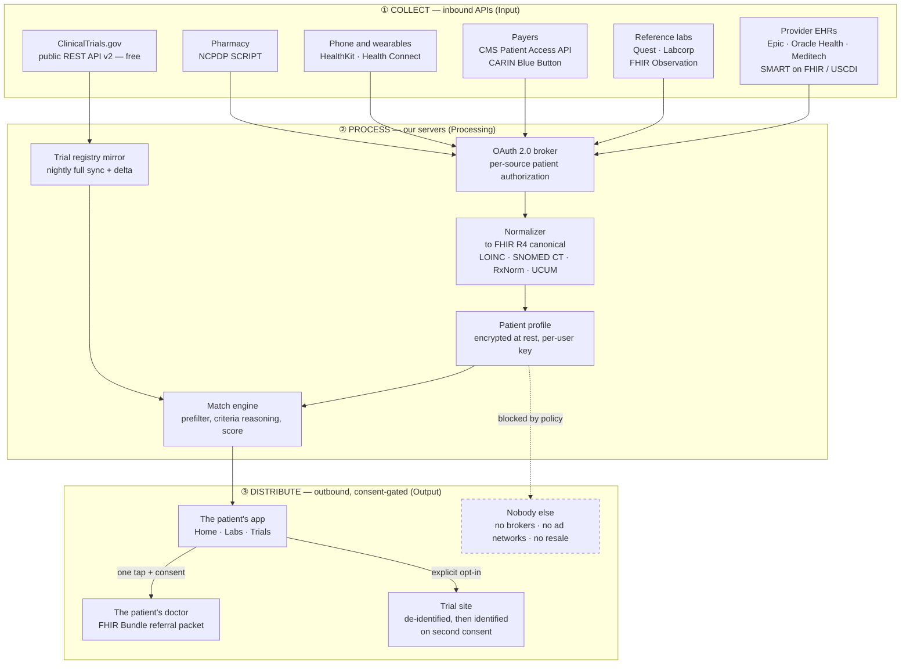
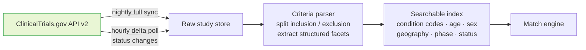
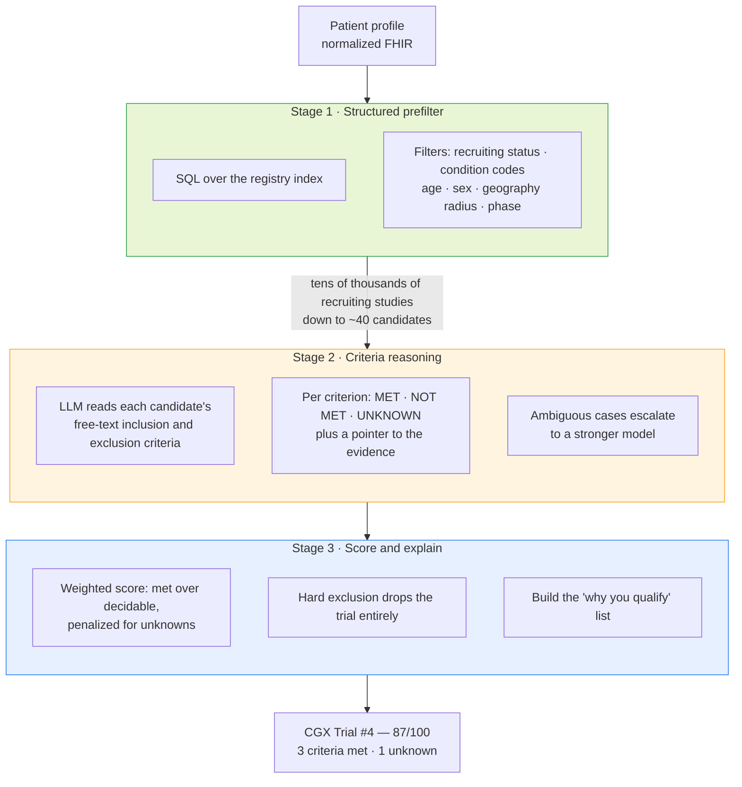
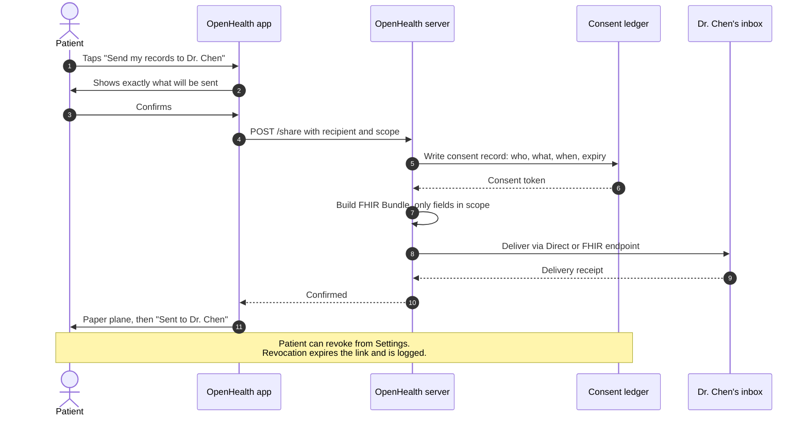
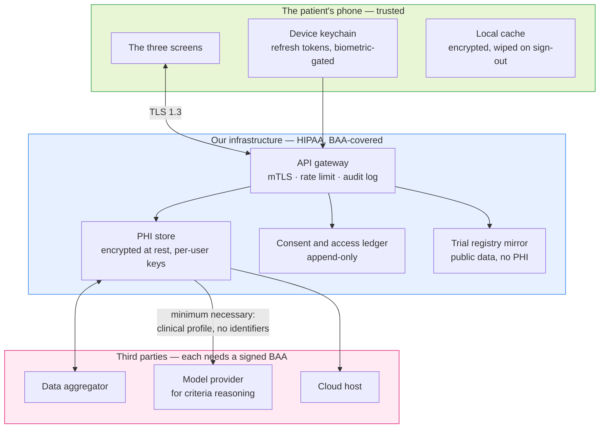

# OpenHealth — Data Flow Architecture

> **How OpenHealth collects data from APIs, processes it, and distributes it.**
>
> This describes the **real deployment** — the system the prototype is a picture of. The
> prototype in `index.html` has none of this; it ships realistic fake data so the three
> screens can be demonstrated without touching a real patient record. Read this doc as
> "what the wires would be," and `BRIEF.md` as "what the screens show."
>
> Diagrams are Mermaid and render on GitHub.

---

## 1 · The whole system at a glance

Three bands, matching the class I→P→O requirement: **collect** (Input), **normalize +
match** (Processing), **distribute** (Output).

---

## 2 · The collection layer, source by source

Every row is an API that exists today. The **who pays** column is the reason the cost model
in [`COSTS.md`](COSTS.md) looks the way it does.

| Source | Standard / protocol | What we pull | Feeds screen | Who pays |
|--------|--------------------|--------------|--------------|----------|
| **Provider EHR** (Epic, Oracle Health, Meditech) | SMART on FHIR + OAuth 2.0, USCDI v3 | `Observation` (labs), `Condition`, `MedicationRequest`, `AllergyIntolerance`, `CareTeam`, `Procedure` | 1 · 2 · 3 | Read-only USCDI APIs are **free to the developer**; the health system holds the subscription |
| **Reference labs** (Quest, Labcorp) | FHIR `Observation`, legacy HL7v2 feeds | Ferritin, CBC, lipid panel, metabolic panel | 2 | Per-transaction, or bundled via an aggregator |
| **Payers** | CMS Interoperability and Patient Access API, CARIN Blue Button | `Coverage`, `ExplanationOfBenefit` | 1 (insurance row) | Federally mandated — free to the patient's app |
| **Phone and wearables** | Apple HealthKit, Android Health Connect | SpO₂, heart rate, activity, sleep | 2 (SpO₂ = 97%) | Free, on-device |
| **Pharmacy** | NCPDP SCRIPT / Surescripts | Active medication list | 3 (exclusion criteria) | Per-transaction network fee |
| **ClinicalTrials.gov** | Public REST API v2 | Every registered study plus full eligibility-criteria text | 3 | **Free. No API key, no signup.** ~50 req/min per IP — which is exactly why we mirror it |
| **Aggregator** (1upHealth, Health Gorilla, Metriport) | One API in front of thousands of endpoints | All of the above, pre-normalized | all | Per-member-per-month — the single largest line item |

### Why an aggregator instead of direct integrations

Connecting to roughly a thousand health systems one at a time is a multi-year integration
project. An aggregator has already done it and sells access per member per month. The
tradeoff is real: we pay a margin and inherit their coverage gaps, but we ship in months
instead of years.

**Plan:** aggregator for breadth from day one; direct Epic and Oracle integrations later
for the top systems, where volume makes eliminating the margin worth the engineering.

### Why we mirror the trial registry instead of querying it live

ClinicalTrials.gov v2 is free and public but rate-limited to roughly 50 requests per minute
per IP. A single match run reads thousands of study records. At even 1,000 users that is
impossible live — and it would be an abuse of a public good. So:

One nightly sync serves every user. Registry cost therefore stays **flat** as users grow —
a rare and very useful property in this cost model.

---

## 3 · Normalization — the unglamorous part that makes matching possible

Trial eligibility criteria are written in **codes and units**. Patient records arrive as
**names, and whatever units the lab felt like using**. Matching is impossible until both
sides speak the same language.

| Axis | Standard | Example |
|------|----------|---------|
| Lab observations | **LOINC** | Ferritin → `2276-4` |
| Conditions / diagnoses | **SNOMED CT** | Iron deficiency anemia → `87522002` |
| Medications | **RxNorm** | normalized ingredient plus strength |
| Units | **UCUM** | `ng/mL` is the same quantity as `µg/L`, spelled differently |
| Everything | **FHIR R4** | one internal resource shape regardless of source |

Without this layer, "Ferritin 8 ng/mL" and a criterion reading "serum ferritin below
15 µg/L" never meet. With it, they are one comparison.

---

## 4 · The match engine (the Processing step, in detail)

A funnel, cheapest stage first. This shape **is** the cost model — see
[`COSTS.md`](COSTS.md) §3.

**Stage 1 is nearly free** — milliseconds, a database query — and it eliminates well over
99.9% of studies. **Stage 2 is the expensive part**, because a language model is reading
prose. That is why Stage 1 has to be aggressive: cutting candidates from 40 to 20 halves
the dominant variable cost of the entire product.

### What the score is, and what it isn't

The prototype's **87/100** is the weighted fraction of *decidable* criteria the patient
meets. It is a **screening signal, not an eligibility determination.** Three rules make
that true in the product rather than only in the disclaimer:

1. **Unknowns are shown, never assumed passing.** A missing lab lowers the score.
2. **A hard exclusion removes the trial** instead of lowering its score. A 70/100 that
   hides a disqualifier is worse than no result at all.
3. **Every match carries its reasoning.** The patient sees which criteria drove the number,
   so their doctor can check our work.

---

## 5 · Distribution — what leaves, and on whose authority

That sequence is what the prototype's paper-plane animation stands in for. The animation is
the honest UI for it: one deliberate action, one visible confirmation.

### The three outbound channels, and the wall

| Destination | Trigger | Payload | Revocable |
|-------------|---------|---------|-----------|
| **The patient** (their own app) | Session auth | Everything — it is theirs by right | n/a |
| **Their doctor** | Per-send confirmation | Scoped FHIR Bundle or C-CDA, expiring link | Yes — revocation expires the link |
| **A trial site** | Explicit opt-in, in two stages | De-identified screening set first; identified only after a second consent | Yes, until the site begins screening |
| **Anyone else** | — | **Nothing.** No brokers, no ad networks, no resale, no "anonymized" dataset sales | n/a |

That last row is a *policy*, not a technical limit — which is exactly why it belongs in a
diagram, a doc, and a privacy policy, where someone can hold us to it.

---

## 6 · Trust boundary

What crosses the wire matters more than what the code does. This is the diagram a security
reviewer will actually ask for.

**Three rules this diagram encodes:**

1. **Every box in the third-party band needs a signed Business Associate Agreement before
   a single byte of PHI reaches it.** A missing BAA is a HIPAA violation on its own,
   regardless of how good the encryption is.
2. **Minimum necessary — including to the model.** The criteria-reasoning step gets a
   clinical profile: codes, values, dates. Not a name, address, or account number. It does
   not need them to read a criterion, so it does not get them.
3. **The consent ledger is append-only.** You cannot quietly rewrite who was given what.
   That is what makes the promises in §5 auditable rather than aspirational.

---

## 7 · Failure modes we design for

An architecture doc that only shows the happy path isn't finished.

| Failure | What the patient sees | Why it's handled this way |
|---------|----------------------|---------------------------|
| A provider's API is down | "Labs from Mercy General last synced 3 days ago" | A stale timestamp is honest; showing old data as current is not |
| A lab value is missing | Criterion shows **Unknown**; score drops | Never assume a missing value passes |
| The registry sync fails | Trials tab shows last sync time, no new matches | Better a visibly stale list than a silently wrong one |
| The reasoning model is unavailable | Stage 1 results shown as "possible matches, not yet scored" | Degrade to the cheap stage rather than failing the screen |
| Patient revokes a source | That source's data is deleted; affected scores recomputed and flagged as changed | Revocation has to actually mean something |
| A referral was sent and the patient changes their mind | Link expires, site is notified, ledger records the revocation | Consent that can't be withdrawn was never consent |

---

## 8 · How this maps to the prototype

| Real system | In `index.html` |
|-------------|-----------------|
| Aggregator sync across five providers | "18 new updates, synced from 5 providers" |
| Normalized `Observation` resources | The four biomarker bars, with real units |
| A full Stage 1 + 2 + 3 match run | A hardcoded 87/100 and the "why you qualify" list |
| FHIR Bundle delivery to a provider endpoint | The paper-plane animation and "Sent to Dr. Chen" |
| Consent ledger write | *Not modeled — the prototype has no persistence* |

The prototype is a faithful picture of the **output** of this architecture. It implements
none of it, and `BRIEF.md` says so plainly wherever the distinction matters.

---

## Related docs

- [`MISSION.md`](MISSION.md) — why any of this exists
- [`COSTS.md`](COSTS.md) — what each band above costs to operate, with real vendor prices
- [`RISKS.md`](RISKS.md) — the regulatory and security surface this design creates
- [`BUILDSPEC.md`](BUILDSPEC.md) — the prototype's actual screen spec
