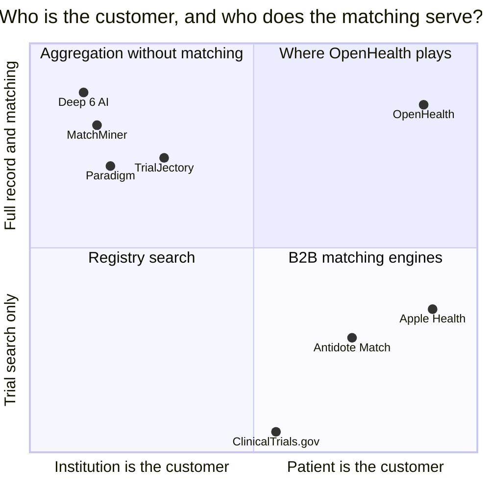

# OpenHealth — Market & Competitive Landscape

> Who else works on this, what they built, and why the patient is still the last to know.
> This is the evidence behind the "first consumer-facing clinical-trial matcher" claim in
> [`BRIEF.md`](BRIEF.md) — including the places that claim needs to be stated carefully.
>
> Figures labeled as in [`COSTS.md`](COSTS.md): `[sourced]`, `[modeled]`, `[assumed]`.
> Checked September 2026.

---

## 1 · The problem the market has failed to solve

| Fact | Figure |
|------|--------|
| Clinical trials that miss their original enrollment timeline | **~80%** `[sourced]` |
| Share of a trial's budget spent on patient recruitment | **~20%** `[sourced]` |
| Cost per enrolled patient via centralized outreach | **$143–$11,392**, by therapeutic area `[sourced]` |

Read those together and the shape of the failure is clear: **enormous amounts of money are
spent finding patients, and it still doesn't work.** Not because the patients don't exist —
because the search runs from the institution outward, and it can only see the patients that
institution already has.

---

## 2 · The landscape, and which way each product points

### The B2B matching engines — good technology, pointed inward

| Product | Customer | What it does | Scale |
|---------|----------|--------------|-------|
| **Deep 6 AI** | Health systems | Mines structured *and* unstructured EHR data for real-time patient-trial matching | **28M+ patients across 2,000+ healthcare facilities** `[sourced]`. Raised $17M at a $50M valuation in 2019 `[sourced]` |
| **MatchMiner** | Cancer centers | Open-source genomic trial matching, built at and for Dana-Farber | Institution-scoped |
| **TrialJectory** | Sites and sponsors, oncology | Queries structured and unstructured trial and patient-history data to generate recommendations | **65,000 profiled patients** `[sourced]` |
| **Paradigm** | Sites and sponsors | Trial access infrastructure and site enablement | Network-scoped |

These are real systems doing hard work well. But note what "28 million patients" means: 28
million *records inside customer institutions*. A patient is matchable if their hospital
bought the software. If they see three providers and none of them did, they are invisible to
all of it — and they will never know the system exists.

**This is the structural gap, and it isn't a technology gap.** The matching works. It's
just aimed at whoever signed the contract.

### The consumer-side products — and where each stops

| Product | What it does | Where it stops |
|---------|--------------|----------------|
| **Antidote Match** | Trial search embedded across **250+ patient communities and health portals**, reaching an estimated **15M patients/month**; free to patients, sponsors pay to distribute `[sourced]` | It's a **search** engine, not a matcher against *your record*. The patient still answers a questionnaire from memory |
| **ClinicalTrials.gov** | The authoritative public registry. Free API `[sourced]` | Raw criteria text written for clinicians. No patient record, no matching, no interpretation |
| **Apple Health / Health Connect** | Excellent record aggregation, real FHIR connections to hundreds of institutions | Aggregation only. Shows you your data; does nothing with it. **No trial matching at all** |
| **Patient portals** (MyChart et al.) | Your data at one institution | One institution. That *is* the fragmentation problem |

### Where that leaves the claim

The precise, defensible version of our claim:

> **Every product that matches a patient's actual clinical record against trial eligibility
> criteria sells to institutions. Every product that serves the patient directly either
> aggregates the record without matching it (Apple Health) or offers trial search without
> the record (Antidote, ClinicalTrials.gov). OpenHealth is the first to do both on the
> patient's side.**

That is narrower than "the first consumer trial matcher," and it's the one that survives a
judge who knows the space. [`BRIEF.md`](BRIEF.md) should say it this way.

---

## 3 · Why now — three things that weren't true before

1. **Patient-access APIs are mandated, not negotiated.** The 21st Century Cures Act
   information-blocking rules and the CMS Interoperability and Patient Access rule require
   providers and payers to make records available to patients through APIs. A patient app
   can now get the record *by right* rather than by partnership.
2. **Aggregation is a commodity.** A per-member-per-month vendor now sits in front of
   thousands of endpoints — one published at **$0.20/user/month** `[sourced]`. What was a
   multi-year integration project in 2018 is a line item.
3. **Free-text criteria are now machine-readable.** Eligibility criteria are prose written
   for clinicians. Reading them reliably at scale was a research problem; language models
   made it an engineering problem with a known unit cost — roughly **$0.19 per full match
   run** `[modeled]`, see [`COSTS.md`](COSTS.md) §3.

Remove any one of these and OpenHealth isn't buildable by a small team. All three landed
inside about five years.

---

## 4 · Market size

Sized honestly — on the recruitment budget we can actually invoice, not on healthcare's
total addressable hand-waving.

| | Definition | Estimate |
|---|---|---|
| **TAM** | US clinical-trial patient-recruitment spend — 20% of trial budgets `[sourced]` across an industry running tens of thousands of trials | Billions annually `[assumed]` — the category is real; a defensible dollar figure needs a paid industry report |
| **SAM** | Recruiting US trials whose criteria are decidable from patient-access API data (labs, conditions, meds, demographics) — excludes trials gated on genomic sequencing or imaging we can't reach | A minority of recruiting trials, concentrated in oncology, hematology, metabolic, and cardiovascular `[assumed]` |
| **SOM (3 years)** | Patients reachable through advocacy-partner distribution in 2–3 condition areas, at the referral economics in [`COSTS.md`](COSTS.md) §5 | Tens of thousands of users; hundreds of billable referrals per month `[assumed]` |

**Being straight about this:** the analyst reports that would firm up the TAM are paywalled,
and a market-size number invented to fill a slide is worse than an honest range. Note also
that the *trial-matching software* market — the B2B category — is the one with published
forecasts, and it is **not** our market. We sell referrals, not software.

---

## 5 · Competitive position

### Why an incumbent probably won't just do this

| Incumbent | Why not |
|-----------|---------|
| **Deep 6 AI, Paradigm** | Their customer is the health system. A consumer app that routes around the health system competes with their own buyer |
| **Antidote** | Closest to us, and the real competitive threat. Adding record-based matching to their distribution would be formidable. Their current product is search, and the 250-portal channel is built for questionnaires, not authorized record access |
| **Apple** | Has the aggregation and the distribution. Has consistently declined to make clinical recommendations — trial matching means telling a user what their data qualifies them for, which is a liability posture Apple avoids |
| **Epic (MyChart)** | Owns the record and the patient relationship, and has built trial-matching features. But the customer is the health system, and MyChart shows you *one* system's view — the fragmentation is the product boundary |

### What we'd actually defend on

Honest ranking — some of these are real moats and some aren't.

| Advantage | Durable? |
|-----------|----------|
| **Patient-side alignment** | **Yes.** Structural, not technical. An incumbent can't adopt it without competing with its own buyer |
| **Advocacy-partner distribution** | **Yes, if earned first.** Trust relationships with condition communities are slow to build and slow to displace |
| **Referral-quality reputation with sites** | **Yes.** Billing on site acceptance means our score honesty compounds into a reputation a competitor has to rebuild from zero |
| Criteria-reasoning quality | Partly. Better prefilters and prompts are a real lead, but a lead in months, not years |
| The three-screen UX | No. Copyable in a quarter |
| The aggregation layer | No. We rent it, same as anyone |

---

## 6 · Risks specific to the market

| Risk | Why it's serious | Early signal to watch |
|------|-----------------|----------------------|
| **Sites won't pay for consumer-sourced referrals** | Kills the revenue model outright. Sites trust their own screening and may not credit ours | Get signed letters of intent *before* building billing |
| **Antidote adds record-based matching** | They have 15M monthly patient reach `[sourced]`; we'd be competing on their strongest axis | Their product announcements; any move toward authorized record access |
| **Patients don't want trials** | The entire demand assumption. Interest concentrates in patients who've exhausted standard care | The pilot's match-to-send rate. This is the go/no-go |
| **Regulatory tailwind reverses** | Weakened patient-access mandates make aggregation slower and costlier | ONC/CMS rulemaking. A real dependency, not background noise |
| **A well-funded entrant with distribution** | A payer or retail-health player could bundle this into an app millions already have | Watch for aggregation-plus-matching in any large consumer health app |

---

## 7 · Sources

- [AI Patient Recruitment for Clinical Trials: Platform Guide (IntuitionLabs)](https://intuitionlabs.ai/articles/ai-patient-recruitment-clinical-trials-platforms) — ~80% of trials miss enrollment timelines; Antidote Match reach and business model; TrialJectory and Deep 6 positioning
- [Deep 6 AI — Clinical Trial Patient Matching for Healthcare Organizations](https://deep6.ai/hcos/) — 28M+ patients, 2,000+ facilities
- [Deep 6 raises $17M at $50M valuation (Forbes, 2019)](https://www.forbes.com/sites/jilliandonfro/2019/11/25/deep-6-raises-17-million-at-50-million-valuation-for-clinical-trial-matching/)
- [Automated Matching of Patients to Clinical Trials: A Patient-Centric NLP Approach for Pediatric Leukemia (*JCO Clinical Cancer Informatics*)](https://pmc.ncbi.nlm.nih.gov/articles/PMC10857751/) — academic precedent for patient-centric matching
- [Clinical Trials Matching Software Market Outlook 2026–2034 (Research and Markets)](https://www.researchandmarkets.com/reports/6183896/clinical-trials-matching-software-market) — the B2B category, paywalled
- [The Ultimate Guide to Clinical Trial Costs (Sofpromed)](https://www.sofpromed.com/ultimate-guide-clinical-trial-costs) — recruitment as ~20% of trial budget
- [Measuring Centralized Patient Outreach Recruitment Strategies and their Costs (*TIRS*, 2026)](https://link.springer.com/article/10.1007/s43441-026-00991-3) — $143–$11,392 per enrolled patient
- [ClinicalTrials.gov API](https://clinicaltrials.gov/data-api/api)
- [Metriport pricing](https://www.saasworthy.com/product/metriport/pricing)
- [Best AI Tools for Clinical Trial Recruitment 2026](https://resources.rework.com/tools/ai-tools/best-ai-tools-for-clinical-trial-recruitment-2026)

---

## Related docs

- [`MISSION.md`](MISSION.md) — the positioning statement this landscape supports
- [`COSTS.md`](COSTS.md) — the referral pricing we're setting against these benchmarks
- [`BRIEF.md`](BRIEF.md) — the class deliverable, including the "computing innovation" claim
- [`ROADMAP.md`](ROADMAP.md) — what has to be proven, in what order
