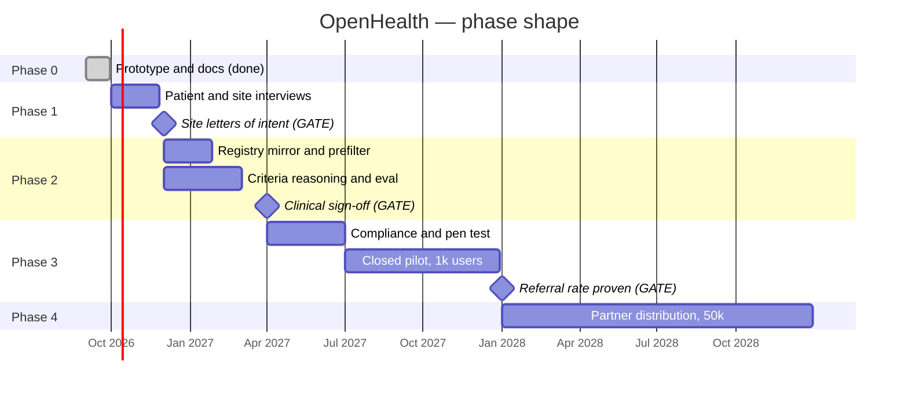

# OpenHealth — Roadmap & What It Would Take

> From a three-screen prototype to something a patient could actually use. Phased by **what
> each phase proves**, not by feature count — because the risk in this product is never
> "can we build it," it's "does anyone want it and will anyone pay."
>
> Figures labeled as in [`COSTS.md`](COSTS.md): `[sourced]`, `[modeled]`, `[assumed]`.

---

## Where we actually are

| | Status |
|---|--------|
| Three-screen interactive prototype | **Done.** Live at the URL in [`README.md`](../README.md) |
| Design system | **Done.** [`DESIGN.md`](DESIGN.md) |
| Concept, problem, I→P→O, deliverable answers | **Done.** [`BRIEF.md`](BRIEF.md) |
| Architecture, cost model, market analysis, risk register | **Done.** This doc set |
| Any real data, any real API, any real patient | **None.** Deliberately |
| Validation that patients want this | **None.** This is the honest gap |

**Current cost to run: $0.** One static HTML file.

---

## The five things that have to be true

Everything below is ordered by which of these it tests. Phase 1 is deliberately the
cheapest way to kill the idea.

| # | Assumption | Currently | Where it's tested |
|---|-----------|-----------|-------------------|
| **A1** | Patients want to know about trials they might qualify for | **Unvalidated** | Phase 1 |
| **A2** | Sites and sponsors will pay for a consumer-sourced referral | **Unvalidated** | Phase 1 |
| **A3** | Eligibility criteria can be matched from patient-access API data accurately enough to be safe | **Unvalidated** | Phase 2 |
| **A4** | ~1% of monthly actives will produce a billable referral `[assumed]` | **Unvalidated** | Phase 3 |
| **A5** | Blended CAC can be held near $11–$15 `[modeled]` via partner distribution | **Unvalidated** | Phase 4 |

**A2 is the one to test first** and it needs no code. If no site will sign a letter of
intent, the product has no business model and everything after this is wasted effort.

---

## Phase 0 — Prototype ✅ *complete*

**Proves:** the idea is legible and the experience is desirable.

Three screens, realistic fake data, live URL, design system, full doc set. Enough for the
class deliverable and the Congressional App Challenge submission.

**Cost: $0.**

---

## Phase 1 — Validation *(no code)*

**Proves: A1 and A2 — that anyone wants this and anyone will pay.**

| Work | Output |
|------|--------|
| Interview 20–30 patients with ongoing conditions, recruited through advocacy organizations | Would they use it? What would they need to trust it? Have they ever been offered a trial? |
| Talk to 5–10 trial sites and study coordinators | Would they accept a consumer-sourced referral? At what price? What makes a referral worth screening? |
| Get **3 signed letters of intent** from sites at a stated referral price | **The go/no-go.** Zero LOIs means stop |
| Healthcare attorney: 2-hour scoping call | Is the FDA CDS posture in [`RISKS.md`](RISKS.md) §3 defensible? |
| Hand-build 10 match runs manually against real ClinicalTrials.gov criteria and synthetic profiles | Is the score meaningful, or does it fall apart on real prose? |

**Cost: $0–$2,000** `[assumed]` (attorney scoping call). **Duration: 4–8 weeks.**

**Kill criteria — stated in advance, honored when they hit:**
- Zero site LOIs → no business model → stop
- Patients consistently say they'd be alarmed rather than helped → the product is wrong
- Attorney says the CDS posture requires FDA clearance → the scope changes fundamentally

---

## Phase 2 — Technical spike *(engineering, still no real patients)*

**Proves: A3 — that the matching actually works.**

| Work | Detail |
|------|--------|
| Mirror the ClinicalTrials.gov registry | Nightly sync + hourly delta, per [`ARCHITECTURE.md`](ARCHITECTURE.md) §2. Free API `[sourced]` |
| Build the criteria parser | Split inclusion/exclusion, extract structured facets |
| Build the Stage 1 structured prefilter | **The highest-leverage component in the product.** Every candidate it eliminates is linear cost savings — see [`COSTS.md`](COSTS.md) §3 |
| Build Stage 2 criteria reasoning | Per-criterion verdicts with evidence pointers |
| **Build a labeled eval set** | 100+ synthetic profiles against real trials, graded by a clinical advisor |
| **Measure false negatives on exclusion criteria specifically** | The dangerous error direction. A missed exclusion is a safety issue; a missed inclusion is only a lost opportunity |
| Connect **one** aggregator sandbox | Prove the FHIR path end to end with synthetic data |

**Cost: $200–$800/month** `[assumed]` (dev infra, aggregator sandbox, model spend on eval
runs). **Duration: 2–3 months.**

**Gate:** exclusion-criteria false-negative rate low enough that a clinical advisor signs
off. **No real patient data until this gate is passed.** No exceptions, no pilot users, no
"just one friendly tester."

---

## Phase 3 — Closed pilot *(first real patients)*

**Proves: A4 — the referral funnel.**

1,000 users, recruited through one advocacy partner in one condition area — hematology is
the natural choice given the prototype's biomarkers.

| Requirement | Reference |
|-------------|-----------|
| Every box in the pre-launch checklist | [`RISKS.md`](RISKS.md) §6 — all of it, not most of it |
| Signed BAAs across the PHI path | Aggregator, cloud host, model provider, error tracking |
| Documented HIPAA risk assessment and written policies | $10k–$30k one-time `[sourced]` |
| Third-party penetration test, findings remediated | |
| Native app or installable PWA | HealthKit / Health Connect access needs native |
| Consent and revocation flows, verified end to end | Including backups |
| Clinical advisor review of every patient-facing string | The copy *is* the safety layer |

**Cost: ≈ $1,700/month** `[modeled]` — the Tier 1 model in [`COSTS.md`](COSTS.md) §4 —
**plus $10k–$30k one-time compliance** `[sourced]`.

**The metrics that decide everything:**

| Metric | Base target `[assumed]` | What a miss means |
|--------|------------------------|-------------------|
| Users who see a match ≥70/100 | 12% | Prefilter or criteria coverage is too narrow |
| Matched users who send to a doctor or site | 33% | The score isn't trusted, or the send flow is scary |
| Sends accepted by a site as qualified | 25% | Our matching is wrong, or sites don't trust us |
| **Billable referrals per MAU per month** | **1.0%** | **Below ~0.3% there is no business** — see [`COSTS.md`](COSTS.md) §5 |
| Authorization revocations per 1,000 accounts | Trending down | We broke faith somewhere |
| Equity: who signed up vs. who the condition affects | Measured, reported | A1 is being served for the wrong patients |

**Kill criteria:** referral rate under 0.3% after 6 months with a working product, or any
confirmed harm to a patient from a match we showed.

---

## Phase 4 — Growth

**Proves: A5 — that we can acquire users at a price that works.**

Target 50,000 users. **This phase is a distribution problem, not an engineering one.**

| Work | Why |
|------|-----|
| Expand to 3–4 condition areas | Diversify the funnel; the referral rate varies enormously by therapeutic area `[sourced]` |
| Partnerships with 5–10 advocacy organizations | **The core GTM.** Antidote reaches ~15M patients/month through 250+ community portals `[sourced]` — that's the model |
| SOC 2 Type II | $25k–$60k/yr `[assumed]`. Required before most sponsors will contract |
| Direct Epic integration for the top systems | Eliminates aggregator margin where volume justifies the engineering. Epic side costs ~$2,400/yr `[sourced]` |
| Prefilter optimization: 40 → 20 candidates | Halves the dominant variable cost `[modeled]` |
| First security hire | |

**Cost: ≈ $27,150/month** `[modeled]` — Tier 2 — **plus $40k–$100k/yr** in audit and
testing `[assumed]`.

**The gate is CAC, and it's tight.** [`COSTS.md`](COSTS.md) §7 puts the ceiling near **$11
blended** for a 3:1 lifetime-contribution ratio, against a **~$560 healthcare category
benchmark** `[sourced]`. Paid acquisition cannot close a 50x gap. If partner distribution
doesn't deliver, the answer is to improve retention or the referral rate — not to buy users.

---

## Phase 5 — Scale

**Proves: it's a business.**

500,000 users. **≈ $172,000/month**, **$0.34 per user** `[modeled]` — Tier 3.

| Work |
|------|
| Genomic criteria matching — the biggest expansion of addressable trials, and the biggest new ethical surface ([`RISKS.md`](RISKS.md) #12) |
| Multi-region infrastructure |
| Direct sponsor relationships alongside site-level referrals |
| Clinical review board |
| Governance commitments that survive a change of control ([`RISKS.md`](RISKS.md) #7) — the data-sale risk is a charter problem, and it should be solved before an acquirer is at the table, not after |

---

## What we'd need that isn't code

The honest answer to "what do you need?"

| Need | When | Why it's not optional |
|------|------|----------------------|
| **A clinical advisor** | Phase 2 | Someone has to sign off that a score presentation is safe. Not a formality |
| **A healthcare attorney** | Phase 1 (scoping), Phase 3 (full) | HIPAA posture, FDA CDS analysis, state law. The product design depends on the answers |
| **An advocacy partner** | Phase 3 | Both the distribution channel and the trust proxy. We have no standing with patients; they do |
| **3 site letters of intent** | Phase 1 | Without these there is no revenue model to build toward |
| **A security engineer** | Phase 4 | [`RISKS.md`](RISKS.md) §1 is permanent. At 50,000 records it needs an owner, not a checklist |
| **Patient advisors** | Phase 1 onward | The consent-theater risk (#6) can only be tested by people who aren't us |

---

## Timeline

Not a commitment — a shape. Phases 1 and 2 are gates, and a gate that fails should stop the
project rather than slip.

---

## Related docs

- [`MISSION.md`](MISSION.md) — the north star and guardrail metrics this roadmap serves
- [`ARCHITECTURE.md`](ARCHITECTURE.md) — what Phase 2 builds
- [`COSTS.md`](COSTS.md) — where every dollar figure above comes from
- [`RISKS.md`](RISKS.md) — §6 is the Phase 3 gate, in full
- [`MARKET.md`](MARKET.md) — who moves while we're doing this
