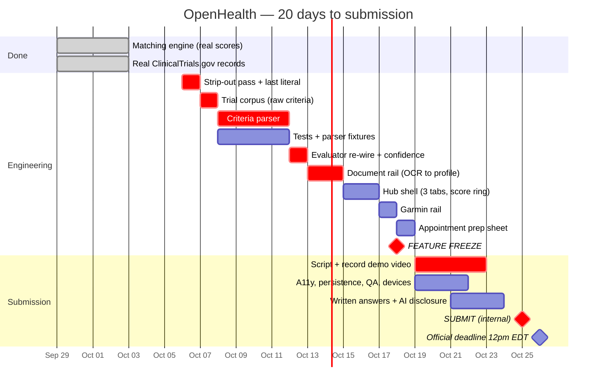

# OpenHealth — Development Roadmap to Submission

> **This is a build plan, not a business plan.** OpenHealth is a Congressional App Challenge
> entry and a class project. There are no users, no revenue, no pilot, no compliance budget.
> The only deadline that exists is the submission deadline, and everything below is ordered
> by what moves the judging score before it.
>
> The long-horizon "what if this were a real company" material still lives in
> [`COSTS.md`](COSTS.md), [`MARKET.md`](MARKET.md) and [`RISKS.md`](RISKS.md). It's good
> supporting evidence for the *Concept* score. It is not work to be done. See
> [Appendix A](#appendix-a--the-hypothetical-company-roadmap).

---

## The deadline

| | |
|---|---|
| **Submission closes** | **12:00 pm EDT, Monday, October 26th, 2026** |
| Today | **October 6, 2026** |
| Runway | **20 days**, of which **12 are build days** before the freeze |
| Practical internal deadline | **Sunday, October 25** — never submit into a noon cutoff |
| After the deadline | **"the Submission cannot be modified in any way"** |

It closes at **noon Eastern, not midnight.** This catches people every year. Treat Oct 25
as the real date and the morning of Oct 26 as pure buffer.

**Primary sources are archived in the repo** — [`assets/intake/cac/`](../assets/intake/cac/).
Every rule quoted in this document is from the official 2026 rulebook PDF, not from a
summary. See [that folder's README](../assets/intake/cac/README.md) for what each file is
and what we took from it.

---

## What is actually being scored

Not three criteria — **six sub-criteria, 5 points each, 30 total**, per the official rubric
([archived locally](../assets/intake/cac/CAC-Judging-Rubric.pdf)). This is the single most
useful document in the whole submission process and it changes where the work should go.

### CONCEPT — 15 points

| Sub-criterion | 5 points looks like | Where we are |
|---|---|---|
| **Ideology** | "Issue or need is extremely relevant" | **4–5.** Fragmented US health records and trial access is a real, specific, current need |
| **Impact** | "Immense usage of creativity is featured as impact is explained" | **4.** The idea is strong; the *explanation* of impact has to land in the video |
| **Structure** | "Video is innovative and engaging" | **Unscored — the video doesn't exist yet** |

### TECHNOLOGY — 15 points

| Sub-criterion | 5 points looks like | Where we are |
|---|---|---|
| **Function** | "App is functional with **complex features**" | **3–4, up from 2.** The scale reads: 1 lacks functionality · 2 "contains snippets of code/action" · 3 works with errors · 4 fully functional · 5 complex features. The engine now computes every trial score from a structured profile, which cleared the mockup floor. Reaching **5** is what [`REBUILD.md`](REBUILD.md) is for |
| **Code** | "**Explanation of code** indicates immense understanding" | **1.** The bottom of this scale is literally *"Video does not explain code"* |
| **UI** | "App is highly innovative in design and interface" | **5.** This is our strongest box and it's already earned |

### Three things that fall out of this

1. **The video is worth up to 10 of the 30 points.** *Structure* is scored on the video
   outright, and *Code* is scored on **how well the video explains the code** — not on
   reading the source. The video is not documentation of the work. It **is** a third of
   the work.
2. **"Code" is currently our floor, and it's the cheapest point to move.** Going from
   "video does not explain code" (1) to "code is effectively explained" (4) costs one
   well-scripted 45-second segment.
3. **"Function" is where the engineering has to go.** The gap between *fully functional* (4)
   and *functional with complex features* (5) is exactly the difference between a mockup
   and something with a real algorithm in it.

### The one structural problem — **solved, and replaced by a harder one**

**What this said, and it was true at the time:** `score:93` and `score:45` were literals, the
eligibility bars were hardcoded pixel widths, and nothing in the app computed anything.

**That is fixed.** `PROFILE` is a structured record, every criterion is stored the way a
protocol states it (`{ analyte, op, threshold, band, weight, required }`), `matchScore()`
produces the number, and the bars are a picture of the same values that produced it. The
patient's missing A1c is handled as a genuine UNKNOWN rather than an assumed pass. *Function*
cleared the mockup floor.

**The new structural problem is one level up.** Those structured criteria were
**hand-transcribed** by a human reading two real trials' eligibility text. That does not
scale, it is the thing a judge will ask about, and it is the difference between *fully
functional* (4) and *functional with complex features* (5):

> The app can evaluate criteria. It cannot yet **read** them. Automating
> free-text-criteria → structured-rule is the remaining work, and it is the actual computer
> science in this project.

[`REBUILD.md`](REBUILD.md) is the plan for it, with the evidence behind the two API decisions
and the corrected competitive claim. **Weeks 1–3 below are superseded by `REBUILD.md` §8.**

> **And judges can ask to see it.** Rules §7.3: judges "have the right to request access to
> the App and source code in person or via any reasonable manner to verify that the App
> functions and operates as stated." **Failure to honor such a request is immediate
> disqualification.** The source has to match the claims in the video.

**Weeks 1–2 exist to move *Function* from 2 to 4–5. Week 4 exists to move *Code* from 1 to
4–5.** That's up to 7 points of the 30, and it's where every remaining hour should go.

---

## ✅ Week 1 — Sep 29 → Oct 4: make the score real — **DONE**

**Goal was: no number displayed in the app is a literal.** Delivered, in commits `0afc7ef`
(real matching engine) and `654398b` (real ClinicalTrials.gov records):

| # | Work | Status |
|---|------|--------|
| 1.2 | Structured patient profile — labs as `{ analyte, value, unit, refLow, refHigh, drawnOn }` | ✅ `PROFILE`, folded out of `MARKERS` so the chart and engine can't disagree |
| 1.3 | Structured trial criteria — `{ analyte, op, threshold, required }` | ✅ plus `band` (near-miss tolerance) and `weight` |
| 1.4 | `evaluateCriterion()` → `{ pass, margin, evidence }` | ✅ |
| 1.5 | `matchScore()` weighting per-criterion results into 0–100 | ✅ 93 and 45 now fall out of it |
| 1.6 | Bar widths derived from `margin` | ✅ the chart is a picture of the score's own numbers |
| 1.7 | Real ClinicalTrials.gov records — real NCT IDs, real criteria text, real sponsors | ✅ `NCT06942208`, `NCT07502508`; patient stays synthetic |

**One item is outstanding:** the home health score is still `countUp(…, 87)` — a literal. It
is the last number in the app the engine doesn't produce. Fix it in the first pass below.

| # | Still a blocker | |
|---|---|---|
| 1.1 | **Confirm the district is participating and register** — prerequisites immediately below. If the Member isn't hosting, nothing else matters | **Verify this is done before building anything further** |

### Registration prerequisites — gather before sitting down to register

From rules §2. Two of these routinely cause a stall:

- A **personal email address that is not the school account**
- **Home** address with **9-digit** zip, Congressional District, and Member of Congress
- **School** address with **9-digit** zip, Congressional District, and Member of Congress
- A **parent or guardian's** name and email
- Coding teacher or mentor name and email (optional)

Other eligibility facts worth confirming once, from §1:

| Rule | Detail |
|---|---|
| Enrollment | Must be enrolled in middle or high school **on October 26, 2026** |
| District | Compete in the district where you **live or attend school** — one district only, one app only |
| Teams | Up to **4** students; **at least half** must live or attend school in the same district |
| Prior work | The app must have been created **after October 30, 2025**. OpenHealth started in September 2026 — fine |

---

## Weeks 2–3 — Oct 6 → Oct 18: the twelve days to freeze

> **Rewritten 2026-10-06.** This replaces the previous Weeks 2–3 table, which had been
> annotated "superseded by [`SIMPLIFY.md`](SIMPLIFY.md) §7" but still read as the plan. This
> section *is* the plan now: `SIMPLIFY.md` §7 says **what** to build and in what order,
> `REBUILD.md` says **why**, and the table below puts both on dates and reconciles them with
> the items that carried over from the old schedule.

**Goal: move *Function* from 4 to 5 — "functional with complex features."** *UI* is already a
5 and can't go higher. *Function* is the only engineering box with room left in it, and the
gap between 4 and 5 is precisely the difference between evaluating hand-transcribed criteria
and parsing them out of the registry's own text.

### The honest arithmetic, before the calendar

`SIMPLIFY.md` §7 totals **≈12.5 days against 12**. But that total counts only the eight new
items. The old schedule had seven more that are still real work and were never cut:

| Carried over | Days | Where it goes now |
|---|---|---|
| 2.0 Kill the last literal — home score `countUp(…, 87)` | 0.5 | Folded into the strip-out pass. It is the only number left that the engine doesn't produce |
| 2.4 Test harness + parser fixtures | 1.5 | **Rides alongside the parser, not after it.** Scheduled below |
| 3.1 Manual entry + unit normalization | 1.5 | Mostly absorbed by §7 item 4 — it is the OCR correction path now, and the offline demo path |
| 3.3 Near-miss output + in-UI disclaimers | 1 | Absorbed by §7 items 2 and 7 |
| 3.5 Accessibility pass | 1 | **After freeze** — not a feature, so freeze-legal |
| 3.6 Persistence (`localStorage`, `try/catch`, no-storage fallback) | 0.5 | **After freeze** |
| 3.7 `/design-review` + `/qa-only`, edge and empty states | 1 | **After freeze** |
| 3.8 Cross-device check + repo as a deliverable | 1 | **After freeze** |

So the true figure is **≈14 build days of features against 12**, with another **3.5 days of
non-feature work** that the post-freeze week can legally absorb. Two days over is not a
scheduling error to be smoothed out — it is why `SIMPLIFY.md` §7 has a cut order, and the
calendar below is drawn so that the things it says to cut first are the things that fall off
the end if a day is lost.

### The calendar

> **Progress, 2026-10-07.** `UPDATELOGV1.md` closed all seven of its stages in two sittings,
> which covers every row below through **Tue Oct 14** — six calendar days ahead. The four
> items `SIMPLIFY.md` §7 marks *never cut* (1, 2, 3, 4) are **all shipped**. What remains is
> the cuttable tail: the hub shell, the Garmin rail and the prep sheet, which are
> `UPDATELOGV2.md`. The rows below are marked rather than deleted so the plan and what
> happened can still be compared.

| Date | Work | §7 item | Days | State |
|---|---|---|---|---|
| **Mon Oct 6** (tonight) | **Strip-out pass** — doctor flow, Jordan Reyes, condition input, `Doctors Available: 9`, and the last `countUp` literal | 5 | 0.5 | ✅ **Done** — V1 stage 1 |
| **Tue Oct 7** | **Trial corpus** — ~20–25 real ClinicalTrials.gov records, raw `eligibilityCriteria` saved **verbatim** | 3 | 1 | ✅ **Done** — V1 stage 2, 23 records |
| **Wed Oct 8 → Sat Oct 11** | **Criteria parser** — free text → predicates: inclusion/exclusion split, then numeric, range, presence, negation, and an explicit **`unparsed`** bucket | 1 | 4 | ✅ **Done** — V1 stage 3 |
| *(alongside, Oct 8 → Oct 11)* | **Test harness + parser fixtures** — `tests.html` asserting known profiles produce known verdicts: exactly at threshold, missing lab, all-fail, unparsed criterion | 2.4 | 1.5 | ✅ **Done** — V1 stage 4, now **61 cases** |
| **Sun Oct 12** | **Evaluator re-wire** — `evaluateCriterion` / `matchScore` read the parser's output instead of hand-written objects. Score **and** confidence, two numbers | 2 | 1 | ✅ **Done** — V1 stage 5 |
| **Mon Oct 13 → Tue Oct 14** | **Document rail** — Tesseract.js → parser → profile, with in-place user correction. The headline input, and the one that removes the condition question | 4 | 2 | ✅ **Done** — V1 stage 6 |
| **Wed Oct 15 → Thu Oct 16** | **Hub shell** — 3-tab nav, Health Score ring with its `n of N markers` confidence line, Metrics tab | 6 | 1.5 | **V2** |
| **Fri Oct 17** | **Garmin rail** — sync script, `garmin.json`, reader, and the vitals trend on the near-miss callout | 7 | 1.5 | **V2** |
| **Sat Oct 18** | **Appointment prep sheet** — a real generated download | 8 | 1 | **V2 — not built. The app produces no file yet** |
| **🔒 Sat Oct 18, EOD** | **FEATURE FREEZE** | — | — | — |

**Why the prep sheet sits last:** `SIMPLIFY.md` §7 says cut 8 first, then 7, then 6, so the
last day holds the first thing to go. One tension worth naming out loud: §9's third answer
("it does not contact your doctor; it prepares the sheet you take to one") leans on the prep
sheet existing. If Oct 18 gets eaten, that sentence has to change with it — don't claim the
sheet in the video and then not ship it.

**Never cut items 1, 2, 3, or 4.** They are the app. Cutting 7 costs the Metrics tab its best
content; cutting 6 means shipping the existing three screens with the new engine behind them,
which loses no functionality at all.

### The screen spec — and why Figma Make is not on this calendar

Design work is **not** a line item above, because the design question is already answered.
`Screenshot 2026-10-06 153715.png` settles the visual language for the home screen, and
[`FIGMA-MAKE-PROMPT.md`](FIGMA-MAKE-PROMPT.md) is a complete 10-screen specification —
layout, the colour token per biomarker, and the six rules that apply everywhere (no search
bar, unknown is never a zero or a dash, score and confidence never merge, nothing is sent
anywhere, verdicts legible without colour, every number a placeholder).

**Keep that doc. Build from it directly.** A second pass through Figma Make is off the plan
for three reasons: the visual language it would resolve is already resolved; its output is
React + Tailwind, which this project cannot consume (see [`STACK.md`](STACK.md) §4 — what
makes handoff cheap here is the token layer in [`DESIGN.md`](DESIGN.md), not a framework);
and the two screens the prompt itself calls the ones to get right — **3, extraction review,
and 7, the trial audit** — are precisely the screens whose layout is driven by engine output,
where a static mock with `79/100` baked into it teaches nothing and risks a retired number
leaking into the build.

Screens 3, 8 and 10 have no visual reference yet. They get sketched in HTML, on the days
above, where a long analyte name or a three-digit score breaks the row immediately instead of
looking fine in a picture.

**Definition of done (revised 2026-10-06):** open the app, **upload a lab document — without
telling it what condition you have** — and get every known trial ranked, each with a
per-criterion table where every row is parsed from the registry's own text, and the rows the
parser couldn't read shown honestly rather than dropped. Download the prep sheet and it is a
real file. Tests pass. **Works with the network off, because there are no network calls.**

> **Walked end to end 2026-10-07** (V1 stage 7), and the clause about the network needed
> correcting rather than ticking. Everything before it holds: the document goes in, nothing
> asks what condition you have, 23 trials rank, the audit rows are parsed from the registry's
> text and the unread ones are shown verbatim. The prep sheet is **not built** — it is V2, and
> until it ships the app produces no file, so the §9 answer that leans on it cannot be said in
> the video yet. And "there are no network calls" is not accurate: there are three Google Fonts
> requests at load and, on the first document only, the Tesseract.js bundle from one CDN.
> Neither carries anything of the user's, and the app was verified fully functional with both
> hosts unreachable — fonts fall back, and the document rail says it is offline and hands you
> the typing path, which works. The honest claim is **"nothing you give it ever leaves the
> device,"** not "there are no network calls." See [`ARCHITECTURE.md`](ARCHITECTURE.md) §8,
> *What leaves the device*.

### 🔒 FEATURE FREEZE — end of day Saturday, October 18

**After this date: bug fixes only.** No new screens, no new trials, no new animations. A
feature added on Oct 22 that breaks on Oct 25 is how good projects get submitted broken.
Anything that arrives late goes on the cut list and gets mentioned in the video as "what's
next," which scores *better* than a half-finished feature anyway.

**What the freeze does not block**, and what therefore gets done in Week 4 alongside the
video — none of it is a feature, so none of it violates the freeze:

| | Days |
|---|---|
| Accessibility pass — keyboard nav, visible focus rings, `prefers-reduced-motion`, roles verified | 1 |
| Persistence — `localStorage` for last-viewed marker, every access in `try/catch` with a working no-storage fallback | 0.5 |
| `/design-review` + `/qa-only`, then fix what they find; edge and empty states (no matching trials, no readable values, OCR failure) | 1 |
| Cross-device check — real iPhone, real Android, desktop — and the repo as a deliverable: README screenshots, clean `docs/` index | 1 |

---

## Week 4 — Oct 19 → Oct 25: the video and the submission

The rules call the video "the most critical component" of the application, and the rubric
backs that up — **up to 10 of 30 points are scored on it.** The 3.5 days of non-feature work
listed under the freeze above shares this week with it.

### Required in the video — all six, per the rules

Not suggestions. A missing one is a dropped point on *Structure*.

- [ ] The **name(s) of each participant**
- [ ] The **name of the app**
- [ ] The **purpose of the app — in one clear sentence** (the rules specify one sentence)
- [ ] The **target audience** — who it's for
- [ ] **The tools and coding languages used** — say "HTML, CSS, and vanilla JavaScript, no frameworks" out loud
- [ ] **Showcase the functionality**

### Suggested cut — 2:45 of a 3:00 maximum

| Time | Beat | Rubric target |
|------|------|---------------|
| 0:00–0:15 | Name, app name, purpose in one sentence, target audience | *Structure* |
| 0:15–0:40 | **The problem, with the number:** trial eligibility is published as free text full of thresholds, and **40–60% of patients who start screening get rejected** — often over one value they missed by a little. Show a real trial's raw criteria text on screen. *It looks unreadable, because it is* | *Ideology* |
| 0:40–1:20 | Walk the three screens — Home → Labs → Trials | *UI* |
| **1:20–2:20** | **The parser and the engine. Show the code.** Take that same unreadable criteria text → `parseCriteria()` → structured rules → `evaluateRule()` → the per-criterion audit table. Land three beats: the **near miss** ("short by 2"), the **UNKNOWN** (the patient's A1c was never drawn — it does *not* count as a pass), and the **unparsed criteria shown honestly**. Then change a lab value and let the score and ranking move | ***Code* + *Function* — the highest-value minute in the project** |
| 2:20–2:35 | Tools and languages — "HTML, CSS, vanilla JavaScript, no frameworks, no backend." **Then the honesty line:** *"The trials are real, from the ClinicalTrials.gov API. The data standard is real — it's what the Cures Act makes every hospital expose. The server is a public test server, and the patient is synthetic, because I'm never touching real patient data."* And the scaling judgment: *"I query the registry live because I have one user; at a thousand I'd mirror it nightly"* | *Code* |
| 2:35–2:45 | Impact, the unintended consequence (showing a threshold invites gaming it), and what 2.0 would be | *Impact* |

**The "data is fake" apology is retired.** It was the right line when the app was a mockup. It
is now both inaccurate and a dropped point — *"the trials are real and here's exactly what
isn't"* is a stronger sentence and a true one.

| # | Work | Detail |
|---|------|--------|
| 4.1 | **Write the script word for word first** | 1–3 minutes, hard limit. Over-length "may be penalized at judges' discretion," and the rubric's 1-point box is "video does not follow time limit." Time the read-through |
| 4.2 | Record screen capture on a real phone, clean audio, no background noise | Rubric penalizes "technical issues, cuts, or is confusing." Re-record rather than ship a bad take |
| 4.3 | Upload to **YouTube or Vimeo** — **the video must be set to "public"** | Rules state this explicitly. **Not unlisted.** Verify it plays logged-out |
| 4.4 | Answer the six submission questions (below) | |
| 4.5 | **Write the AI disclosure** | See below. Non-optional |
| 4.6 | **Submit Sunday Oct 25** | Deadline is noon Monday, and **after the period ends the submission cannot be modified in any way** |

### The six questions — known in advance, so draft them in advance

The rules publish them. Q4 is the one that rewards the entire Week 1–2 plan:

1. What is the title of your app?
2. Explain the app's purpose.
3. What inspired you to create this app?
4. **What technical/coding difficulty did you face in programming your app, and how did you address this technical challenge?**
5. What did you learn while participating in the CAC? What was your biggest takeaway?
6. What would you change about your app if you were to create a 2.0 version?

**Q4 is the Technology score in written form.** The honest, specific answer is the criteria
engine: turning free-text trial eligibility prose into structured, machine-comparable
criteria, deciding how to weight a near-miss against a hard fail, and handling the case where
a patient simply has no value for a required lab. Name the actual problem and the actual fix.
Vague answers score vaguely.

**Q6 has a ready answer** — the cut list further down, plus Appendix A.

### The AI disclosure — read this carefully

Two rules in §3 apply, and they have to be read together:

> **ORIGINALITY:** "The app must be original and solely created by the contestant. **All
> coding and technical development must be done by the student or student team.** While
> participants may use open-source libraries, frameworks, and external tools, they must
> clearly document any such usage and ensure their project reflects significant personal
> effort and technical understanding."
>
> **AI USAGE:** "The use of AI tools in app development for the Congressional App Challenge
> is permitted, **provided that all AI usage is fully disclosed in the submission
> materials.** AI may only be used to support **specific aspects** of the project and **must
> not constitute the entirety of the technical development.** Participants are expected to
> demonstrate significant individual contributions and technical understanding of their app."

This project has been built with Claude Code. That is permitted, and it is conditional.
Three consequences that are actually load-bearing for the plan:

1. **Disclose specifically, not vaguely.** "Used Claude Code for the CSS design system,
   the doc set, and review passes; the matching engine was specified, reviewed, tested and
   debugged by me" is a disclosure. "Used AI" is not.
2. **"Must not constitute the entirety of the technical development" is a real constraint,
   and Week 1 is the answer to it.** The matching engine is the core technical work of the
   app. It should be the part with the most of your own thinking in it — the scoring weights,
   the near-miss-vs-hard-fail decision, the missing-lab case. These are design judgments, not
   generated code, and they're exactly what Q4 asks about.
3. **You have to be able to explain every line, on demand.** §7.3 lets judges request the
   source in person. Budget real time in Week 3 to read `index.html` end to end until you
   could whiteboard `matchScore()` cold. The rubric's top *Code* box is "explanation of code
   indicates immense understanding" — that is unfakeable, and it's 5 points.

**The comfortable position here is also the highest-scoring one.** Own the engine, disclose
the rest plainly, and both the rules and the rubric reward you for it.

4. **A fourth consequence, added 2026-10-02: this is a reason the parser is deterministic.**
   [`REBUILD.md`](REBUILD.md) §7 recommends building criteria extraction with your own rules
   rather than calling a model API, and the AI-usage rule above is part of why. A parser you
   wrote is technical development you can explain, defend, and claim. A model call that returns
   the answer is the one thing in this project that would sit awkwardly against *"AI may only
   be used to support specific aspects"* — and it would also make Q4, the question that
   rewards this whole plan, much harder to answer well. **The honest version is also the one
   that scores higher.**

---

## Schedule

---

## Cut list — explicitly not doing

Named so they don't get picked up at 1am on Oct 24.

| Not doing | Why |
|-----------|-----|
| Real API connections (Epic, FHIR, aggregators) | **REVERSED 2026-10-02, then RE-CUT 2026-10-06.** The 10-02 reversal was correct on the facts — `r4.smarthealthit.org` and ClinicalTrials.gov v2 are both unauthenticated CORS GETs needing no account, key, backend or BAA. They are cut anyway, for a different reason: the synthetic patient they served was the most confusing thing in the demo, and the app no longer needs a search because it no longer asks what condition you have. See [`SIMPLIFY.md`](SIMPLIFY.md) §4.3–4.4. **The FHIR R4 / US Core format and LOINC coding are kept** |
| Any runtime network call at all | Follows from the above. The trial corpus and `garmin.json` are committed files. This removes the single largest demo-day risk in the previous risk register |
| A live wearable sync, or any OAuth | Garmin's Health API needs partner approval, OAuth 1.0a signing and a hosted webhook. Replaced by a **local sync script that commits a snapshot every few days** — real data, no server. [`SIMPLIFY.md`](SIMPLIFY.md) §5.2 |
| An AI chat surface, or an AI document reader | Both need a key, which needs a proxy, which needs a server. OCR runs in-browser instead. [`STACK.md`](STACK.md) §6b |
| Contacting a doctor, in any form | **Deleted 2026-10-06, not deferred.** There are no doctors on the other end, so the screen was theater. Replaced by a real downloadable prep sheet. [`SIMPLIFY.md`](SIMPLIFY.md) §4.1 |
| Epic / Oracle **production** integrations, or any aggregator | This part of the original line stands. Needs contracts and BAAs. The public sandboxes give us the same standard for free |
| A backend, auth, or a database | A static file is a feature here: the judge opens one link and it works |
| Native iOS/Android build | Web app is explicitly an eligible platform. A build pipeline is 2 weeks of risk for 0 points |
| Rewriting in React/Next.js | See [`STACK.md`](STACK.md). Framework choice is not scored; working software is |
| **A Figma Make pass on the screens** | **Cut 2026-10-06.** The visual language is already settled by `Screenshot 2026-10-06 153715.png`, and [`FIGMA-MAKE-PROMPT.md`](FIGMA-MAKE-PROMPT.md) is kept and used as the **10-screen written spec** instead. Figma Make emits React + Tailwind, which this stack cannot consume, so the output would be a picture to copy from — and screens 3 and 7 are driven by engine output, where a mock with placeholder numbers is a liability. See Weeks 2–3 |
| Any real patient data, ever | Not a roadmap item — a permanent rule |
| Genomic matching, multi-condition expansion | Post-submission ideas. They belong in the video's "what's next," not in the code |

---

## Risk register (the only risks that matter now)

| Risk | Mitigation |
|------|-----------|
| **District isn't hosting a challenge** | Check in Week 1, day 1. Nothing else matters until this is confirmed |
| **Noon deadline misread as midnight** | Internal deadline Oct 25. And note: **after the period ends the submission cannot be modified in any way** — there is no fixing it later |
| **Video left "unlisted"** | Rules require **public**. Verify logged-out on a phone with a different network |
| **Video omits a required element** | Six required items, checklist in Week 4. The "tools and coding languages" one is the easiest to forget |
| Video runs long and gets penalized | Scripted and timed, not improvised. Rubric's 1-point box is "does not follow time limit" |
| Feature added late breaks the demo | Freeze on Oct 18, enforced |
| ~~An API is down, slow, or rate-limited during the demo or the video shoot~~ | **RETIRED 2026-10-06.** There are no runtime network calls left to fail. This was the top risk and cutting live search removed it outright, which is a large part of why that cut was worth making |
| **The Garmin sync script breaks before the deadline** | Low impact by design: the app reads the last committed `garmin.json` and never calls Garmin itself. If `python-garminconnect` breaks on Oct 24, the demo is unaffected. Refresh the snapshot once before the video and once before submission, then leave it alone |
| **OCR misreads a lab value on camera** | Real and likely on a phone photo of a creased page. Mitigation: the app **shows what it extracted, with its confidence, for correction before it enters the profile** — so a misread is a visible, correctable step rather than a silent wrong number. Shoot the video with a clean scan, and demo the correction path deliberately rather than hoping it does not come up |
| **The parser silently mis-extracts a threshold** | Worse than failing to parse, because the number looks right. Mitigation: the `unparsed` bucket is shown, never dropped (§ REBUILD design rule 1); parser fixtures in item 2.4; and the per-criterion table prints the extracted rule next to the patient's value, so a wrong extraction is visible on screen rather than buried in a score |
| **Judge reads the score as medical advice** | Output is always "worth asking about," never "you qualify." Stated in the UI, not only the video. See [`RISKS.md`](RISKS.md) #2 and #3 |
| **Near-miss feature read as coaching a patient to game a threshold** | Real, and named as the unintended consequence in [`BRIEF.md`](BRIEF.md) §5. Never suggest how to move a value; frame every near-miss as a question for a doctor. Answer it directly in the video rather than waiting to be asked |
| **Judge requests the source and it doesn't match the video** | §7.3 — refusing is *immediate disqualification*, and a mismatch is worse than a modest claim. Only claim what the code does |
| Can't explain the code when asked | Week 3 read-through; engine written deliberately in Week 1 |
| AI disclosure judged insufficient | Written specifically, listing what was AI-assisted and what wasn't |

---

## Submission checklist

Every box, before Oct 25.

**Eligibility & registration**
- [ ] District confirmed as participating; registered at congressionalappchallenge.us
- [ ] Eligibility quiz passed; confirmation email received
- [ ] Personal (non-school) email, both 9-digit zips, parent/guardian contact on file

**The app**
- [ ] Live at a stable URL, opened and tested on someone else's device
- [ ] **Every displayed number computed, not hardcoded** — including the home health score
- [ ] **Works with the network off** (manual-entry path + cached trials). Verify by actually disabling wifi
- [ ] **Degrades honestly when an API fails** — shows cache age, never a blank screen or a silent wrong number
- [ ] **Unparsed criteria are visible in the UI**, not dropped
- [ ] **Score and confidence shown as two separate numbers**
- [ ] A missing lab reads **UNKNOWN**, never a pass (check the synthetic patient's absent A1c)
- [ ] Tests present and passing, **including parser fixtures from real trial text**
- [ ] Keyboard-navigable; reduced-motion honored
- [ ] Repo README current, with screenshots
- [ ] Source matches every claim made in the video (§7.3)
- [ ] **No API keys anywhere in the source** — if one appeared, so did a backend. See [`STACK.md`](STACK.md) §6a

**Claims audit** — the cheapest points to lose
- [ ] **No doc or video claims OpenHealth is the "first" consumer trial matcher.** It isn't. Use the precise claim from [`MARKET.md`](MARKET.md) §2
- [ ] No score quoted as a constant anywhere ("87/100" is retired)
- [ ] The real/synthetic line stated accurately: trials real, standard real, server public test, patient synthetic

**The video** — 10 of 30 points
- [ ] 1–3 minutes, timed
- [ ] Participant name(s) stated
- [ ] App name stated
- [ ] Purpose in **one clear sentence**
- [ ] Target audience stated
- [ ] **Tools and coding languages stated**
- [ ] Functionality showcased
- [ ] **Code explained on screen** (the *Code* sub-criterion lives here)
- [ ] Uploaded to YouTube/Vimeo and set to **PUBLIC**, verified logged-out

**Written**
- [ ] All six questions answered and proofread
- [ ] Q4 names the real technical difficulty, specifically
- [ ] **AI usage disclosed specifically**
- [ ] Can explain `matchScore()` **and `parseCriteria()`** cold, on a whiteboard, with no notes

- [ ] **Submitted — Sunday Oct 25** (no edits possible after the deadline)

---

## Appendix A — the hypothetical company roadmap

The earlier version of this document laid out a five-phase path from prototype to 500,000
users: validation interviews, site letters of intent, a HIPAA compliance budget, a closed
pilot, unit economics at scale.

**None of that is work to be done.** There are no users and there never will be. It is kept
because it's *evidence for the Concept score* — it shows the problem was taken seriously past
the screen layer — and because "what would it take to make this real?" is the most likely
question from a judge or a Member of Congress.

The material lives in:

- [`COSTS.md`](COSTS.md) — what it would cost to run at 1k / 50k / 500k users
- [`MARKET.md`](MARKET.md) — who already does this and why they're all B2B
- [`RISKS.md`](RISKS.md) — HIPAA/FDA surface, the ethical commitments, the risk register
- [`ARCHITECTURE.md`](ARCHITECTURE.md) — how the real data path would work

**Good 20-second answer to "what would it take?":** *"Three things before a line of
production code — a clinical advisor to sign off that showing someone a match score is safe,
a healthcare attorney on the FDA clinical-decision-support question, and one trial site
willing to accept a patient-sourced referral. If none of those land, the honest move is to
stop. The prototype is the cheapest way to find out."*

---

## Related docs

- [`REBUILD.md`](REBUILD.md) — **why the plan looks like this.** The pivot, the two API tests, the corrected competitive claim, and the sources behind every statistic quoted here
- [`BRIEF.md`](BRIEF.md) — the idea and the six required deliverable answers
- [`ARCHITECTURE.md`](ARCHITECTURE.md) **§4a** — the parser/evaluator contract: types, function signatures, the score-vs-confidence formulas, and the unit table
- [`BUILDSPEC.md`](BUILDSPEC.md) — the three-screen spec. Layout still current; content partly superseded, and it says so at the top
- [`MARKET.md`](MARKET.md) **§2** — owns every competitive claim. Check it before repeating one
- [`DESIGN.md`](DESIGN.md) — the design system the polish items check against
- [`STACK.md`](STACK.md) — why it stays one HTML file, and **§6a** on why two real APIs don't change that
