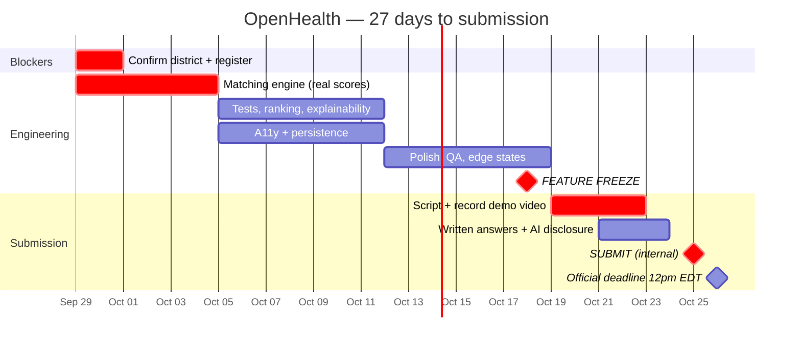

# OpenHealth — Development Roadmap to Submission

> **This is a build plan, not a business plan.** OpenHealth is a Congressional App Challenge
> entry and a class project. There are no users, no revenue, no pilot, no compliance budget.
> The only deadline that exists is the submission deadline, and everything below is ordered
> by what moves the judging score before it.
>
> The long-horizon "what if this were a real company" material still lives in
> [`COSTS.md`](COSTS.md), [`MARKET.md`](MARKET.md) and [`RISKS.md`](RISKS.md). It's good
> supporting evidence for the *Concept* score. It is not work to be done. See
> [Appendix A](#appendix-a--the-hypothetical-company-roadmap).

---

## The deadline

| | |
|---|---|
| **Submission closes** | **12:00 pm EDT, Monday, October 26th, 2026** |
| Today | September 29, 2026 |
| Runway | **27 days / ~4 working weeks** |
| Practical internal deadline | **Sunday, October 25** — never submit into a noon cutoff |
| After the deadline | **"the Submission cannot be modified in any way"** |

It closes at **noon Eastern, not midnight.** This catches people every year. Treat Oct 25
as the real date and the morning of Oct 26 as pure buffer.

**Primary sources are archived in the repo** — [`assets/intake/cac/`](../assets/intake/cac/).
Every rule quoted in this document is from the official 2026 rulebook PDF, not from a
summary. See [that folder's README](../assets/intake/cac/README.md) for what each file is
and what we took from it.

---

## What is actually being scored

Not three criteria — **six sub-criteria, 5 points each, 30 total**, per the official rubric
([archived locally](../assets/intake/cac/CAC-Judging-Rubric.pdf)). This is the single most
useful document in the whole submission process and it changes where the work should go.

### CONCEPT — 15 points

| Sub-criterion | 5 points looks like | Where we are |
|---|---|---|
| **Ideology** | "Issue or need is extremely relevant" | **4–5.** Fragmented US health records and trial access is a real, specific, current need |
| **Impact** | "Immense usage of creativity is featured as impact is explained" | **4.** The idea is strong; the *explanation* of impact has to land in the video |
| **Structure** | "Video is innovative and engaging" | **Unscored — the video doesn't exist yet** |

### TECHNOLOGY — 15 points

| Sub-criterion | 5 points looks like | Where we are |
|---|---|---|
| **Function** | "App is functional with **complex features**" | **2–3.** The scale reads: 1 lacks functionality · 2 "contains snippets of code/action" · 3 works with errors · 4 fully functional · 5 complex features. A UI mockup with hardcoded values sits near 2 |
| **Code** | "**Explanation of code** indicates immense understanding" | **1.** The bottom of this scale is literally *"Video does not explain code"* |
| **UI** | "App is highly innovative in design and interface" | **5.** This is our strongest box and it's already earned |

### Three things that fall out of this

1. **The video is worth up to 10 of the 30 points.** *Structure* is scored on the video
   outright, and *Code* is scored on **how well the video explains the code** — not on
   reading the source. The video is not documentation of the work. It **is** a third of
   the work.
2. **"Code" is currently our floor, and it's the cheapest point to move.** Going from
   "video does not explain code" (1) to "code is effectively explained" (4) costs one
   well-scripted 45-second segment.
3. **"Function" is where the engineering has to go.** The gap between *fully functional* (4)
   and *functional with complex features* (5) is exactly the difference between a mockup
   and something with a real algorithm in it.

### The one structural problem

`index.html:1303` reads `score:93`. `index.html:1325` reads `score:45`. The eligibility bars
are hardcoded pixel widths. **Nothing in the app computes anything.**

That is fine for a UI mockup and it caps the *Function* score near 2 — "app contains snippets
of code/action." The fix is not to fake more. It's to make the numbers on screen be
*produced* by code from data, so the app genuinely has a matching engine — one a judge can
read, one the video can explain, and one the student can defend out loud.

> **And judges can ask to see it.** Rules §7.3: judges "have the right to request access to
> the App and source code in person or via any reasonable manner to verify that the App
> functions and operates as stated." **Failure to honor such a request is immediate
> disqualification.** The source has to match the claims in the video.

**Weeks 1–2 exist to move *Function* from 2 to 4–5. Week 4 exists to move *Code* from 1 to
4–5.** That's up to 7 points of the 30, and it's where every remaining hour should go.

---

## Week 1 — Sep 29 → Oct 4: make the score real

**Goal: no number displayed in the app is a literal. All of them are computed.**

| # | Work | Why it scores |
|---|------|---------------|
| 1.1 | **Blocker first: confirm the district is participating** and register — see the registration prerequisites below. If the Member isn't hosting, everything below is moot | Eligibility gate |
| 1.2 | Extract a **structured patient profile** — each lab as `{ analyte, value, unit, refLow, refHigh, drawnOn }` instead of strings baked into markup | Separates data from presentation. First thing a judge looks for |
| 1.3 | Extract **structured trial criteria** — each criterion as `{ analyte, op, threshold, required }` instead of a prose label and a bar width | Makes eligibility machine-evaluable |
| 1.4 | Write `evaluateCriterion(profile, criterion)` → `{ pass, margin, evidence }` | The actual algorithm |
| 1.5 | Write `matchScore(profile, trial)` that weights per-criterion results into 0–100 | **93 and 45 must fall out of this function**, not be typed |
| 1.6 | Derive the eligibility bar widths from `margin` | The chart becomes a visualization of real output |
| 1.7 | Seed trials from **real ClinicalTrials.gov records** — real NCT IDs, real inclusion/exclusion text, real sponsors. Patient stays fake | Huge credibility jump for $0. "The trials are real, the patient is not" is a great line in the video |

**Definition of done:** change a lab value in the profile object, and the score, the verdict
string, the bar widths, and the qualify/fall-short copy all change correctly without touching
anything else.

### Registration prerequisites — gather before sitting down to register

From rules §2. Two of these routinely cause a stall:

- A **personal email address that is not the school account**
- **Home** address with **9-digit** zip, Congressional District, and Member of Congress
- **School** address with **9-digit** zip, Congressional District, and Member of Congress
- A **parent or guardian's** name and email
- Coding teacher or mentor name and email (optional)

Other eligibility facts worth confirming once, from §1:

| Rule | Detail |
|---|---|
| Enrollment | Must be enrolled in middle or high school **on October 26, 2026** |
| District | Compete in the district where you **live or attend school** — one district only, one app only |
| Teams | Up to **4** students; **at least half** must live or attend school in the same district |
| Prior work | The app must have been created **after October 30, 2025**. OpenHealth started in September 2026 — fine |

---

## Week 2 — Oct 5 → Oct 11: depth a judge can see

**Goal: demonstrate programming skill beyond "it computes a number."**

| # | Work | Why it scores |
|---|------|---------------|
| 2.1 | **A test file** — `tests.html` or an in-page harness asserting known profiles produce known verdicts (edge: exactly at threshold, missing lab, all-fail) | Almost no entry at this level ships tests. Visible, cheap, and it's the clearest possible signal of engineering maturity |
| 2.2 | **Ranking** — feed all trials through `matchScore`, sort, and let the ordering on Home be an output of the engine rather than a fixed list | Shows the engine generalizes past two hand-picked cases |
| 2.3 | **Explainability panel** — per criterion, show the actual comparison (`Ferritin 8 ng/mL < 12 required`) rather than a bar alone | Directly demos the algorithm in the video. Also just better UX |
| 2.4 | Add a 3rd and 4th scored trial so ranking is non-trivial (promote two from the `SOON` list) | |
| 2.5 | **Persistence** — `localStorage` for sent-state and last-viewed biomarker, every read/write in `try/catch` with a working no-storage fallback | State management is a named skill |
| 2.6 | **Accessibility pass** — keyboard nav on the tab bar and biomarker switch, visible focus rings, `prefers-reduced-motion` honored, roles verified | Feeds the Design score and it is genuinely the right thing |
| 2.7 | Run `/qa-only`, fix what it finds | |

**Definition of done:** tests pass, app is fully keyboard-operable, and the trial order on
Home changes if you edit a lab value.

---

## Week 3 — Oct 12 → Oct 18: polish, then freeze

**Goal: stop building. Start finishing.**

| # | Work |
|---|------|
| 3.1 | `/design-review` pass — spacing, hierarchy, motion timing, any remaining inconsistency |
| 3.2 | Edge and empty states: no matching trials, a lab with no recent draw, send-failure path |
| 3.3 | Cross-device check — real iPhone, real Android, desktop browser, and whatever the judge's machine might be |
| 3.4 | Repo as a deliverable: README screenshots, clean `docs/` index, commit history that reads like a build log |
| 3.5 | Capture screenshots into `assets/processed/` for the README and any poster |

### 🔒 FEATURE FREEZE — end of day Saturday, October 18

**After this date: bug fixes only.** No new screens, no new trials, no new animations. A
feature added on Oct 22 that breaks on Oct 25 is how good projects get submitted broken.
Anything that arrives late goes on the cut list and gets mentioned in the video as "what's
next," which scores *better* than a half-finished feature anyway.

---

## Week 4 — Oct 19 → Oct 25: the video and the submission

The rules call the video "the most critical component" of the application, and the rubric
backs that up — **up to 10 of 30 points are scored on it.**

### Required in the video — all six, per the rules

Not suggestions. A missing one is a dropped point on *Structure*.

- [ ] The **name(s) of each participant**
- [ ] The **name of the app**
- [ ] The **purpose of the app — in one clear sentence** (the rules specify one sentence)
- [ ] The **target audience** — who it's for
- [ ] **The tools and coding languages used** — say "HTML, CSS, and vanilla JavaScript, no frameworks" out loud
- [ ] **Showcase the functionality**

### Suggested cut — 2:45 of a 3:00 maximum

| Time | Beat | Rubric target |
|------|------|---------------|
| 0:00–0:15 | Name, app name, purpose in one sentence, target audience | *Structure* |
| 0:15–0:40 | The problem: records scattered across portals, trials nobody hears about | *Ideology* |
| 0:40–1:30 | Walk the three screens — Home → Labs → Trials | *UI* |
| **1:30–2:20** | **The matching engine. Show the code on screen.** Walk `matchScore()`: structured criteria in, per-criterion pass/fail with margins out, weighted to a 0–100 score. Change a lab value, show the score and ranking move | ***Code* + *Function* — the highest-value 50 seconds in the project** |
| 2:20–2:35 | Tools and languages; honest note that data is fake and why | *Code* |
| 2:35–2:45 | Impact and what 2.0 would be | *Impact* |

| # | Work | Detail |
|---|------|--------|
| 4.1 | **Write the script word for word first** | 1–3 minutes, hard limit. Over-length "may be penalized at judges' discretion," and the rubric's 1-point box is "video does not follow time limit." Time the read-through |
| 4.2 | Record screen capture on a real phone, clean audio, no background noise | Rubric penalizes "technical issues, cuts, or is confusing." Re-record rather than ship a bad take |
| 4.3 | Upload to **YouTube or Vimeo** — **the video must be set to "public"** | Rules state this explicitly. **Not unlisted.** Verify it plays logged-out |
| 4.4 | Answer the six submission questions (below) | |
| 4.5 | **Write the AI disclosure** | See below. Non-optional |
| 4.6 | **Submit Sunday Oct 25** | Deadline is noon Monday, and **after the period ends the submission cannot be modified in any way** |

### The six questions — known in advance, so draft them in advance

The rules publish them. Q4 is the one that rewards the entire Week 1–2 plan:

1. What is the title of your app?
2. Explain the app's purpose.
3. What inspired you to create this app?
4. **What technical/coding difficulty did you face in programming your app, and how did you address this technical challenge?**
5. What did you learn while participating in the CAC? What was your biggest takeaway?
6. What would you change about your app if you were to create a 2.0 version?

**Q4 is the Technology score in written form.** The honest, specific answer is the criteria
engine: turning free-text trial eligibility prose into structured, machine-comparable
criteria, deciding how to weight a near-miss against a hard fail, and handling the case where
a patient simply has no value for a required lab. Name the actual problem and the actual fix.
Vague answers score vaguely.

**Q6 has a ready answer** — the cut list further down, plus Appendix A.

### The AI disclosure — read this carefully

Two rules in §3 apply, and they have to be read together:

> **ORIGINALITY:** "The app must be original and solely created by the contestant. **All
> coding and technical development must be done by the student or student team.** While
> participants may use open-source libraries, frameworks, and external tools, they must
> clearly document any such usage and ensure their project reflects significant personal
> effort and technical understanding."
>
> **AI USAGE:** "The use of AI tools in app development for the Congressional App Challenge
> is permitted, **provided that all AI usage is fully disclosed in the submission
> materials.** AI may only be used to support **specific aspects** of the project and **must
> not constitute the entirety of the technical development.** Participants are expected to
> demonstrate significant individual contributions and technical understanding of their app."

This project has been built with Claude Code. That is permitted, and it is conditional.
Three consequences that are actually load-bearing for the plan:

1. **Disclose specifically, not vaguely.** "Used Claude Code for the CSS design system,
   the doc set, and review passes; the matching engine was specified, reviewed, tested and
   debugged by me" is a disclosure. "Used AI" is not.
2. **"Must not constitute the entirety of the technical development" is a real constraint,
   and Week 1 is the answer to it.** The matching engine is the core technical work of the
   app. It should be the part with the most of your own thinking in it — the scoring weights,
   the near-miss-vs-hard-fail decision, the missing-lab case. These are design judgments, not
   generated code, and they're exactly what Q4 asks about.
3. **You have to be able to explain every line, on demand.** §7.3 lets judges request the
   source in person. Budget real time in Week 3 to read `index.html` end to end until you
   could whiteboard `matchScore()` cold. The rubric's top *Code* box is "explanation of code
   indicates immense understanding" — that is unfakeable, and it's 5 points.

**The comfortable position here is also the highest-scoring one.** Own the engine, disclose
the rest plainly, and both the rules and the rubric reward you for it.

---

## Schedule

---

## Cut list — explicitly not doing

Named so they don't get picked up at 1am on Oct 24.

| Not doing | Why |
|-----------|-----|
| Real API connections (Epic, FHIR, aggregators) | No accounts, no BAAs, no time, and zero judging benefit over real *trial* data with a fake patient |
| A backend, auth, or a database | A static file is a feature here: the judge opens one link and it works |
| Native iOS/Android build | Web app is explicitly an eligible platform. A build pipeline is 2 weeks of risk for 0 points |
| Rewriting in React/Next.js | See [`STACK.md`](STACK.md). Framework choice is not scored; working software is |
| Any real patient data, ever | Not a roadmap item — a permanent rule |
| Genomic matching, multi-condition expansion | Post-submission ideas. They belong in the video's "what's next," not in the code |

---

## Risk register (the only risks that matter now)

| Risk | Mitigation |
|------|-----------|
| **District isn't hosting a challenge** | Check in Week 1, day 1. Nothing else matters until this is confirmed |
| **Noon deadline misread as midnight** | Internal deadline Oct 25. And note: **after the period ends the submission cannot be modified in any way** — there is no fixing it later |
| **Video left "unlisted"** | Rules require **public**. Verify logged-out on a phone with a different network |
| **Video omits a required element** | Six required items, checklist in Week 4. The "tools and coding languages" one is the easiest to forget |
| Video runs long and gets penalized | Scripted and timed, not improvised. Rubric's 1-point box is "does not follow time limit" |
| Feature added late breaks the demo | Freeze on Oct 18, enforced |
| **Judge requests the source and it doesn't match the video** | §7.3 — refusing is *immediate disqualification*, and a mismatch is worse than a modest claim. Only claim what the code does |
| Can't explain the code when asked | Week 3 read-through; engine written deliberately in Week 1 |
| AI disclosure judged insufficient | Written specifically, listing what was AI-assisted and what wasn't |

---

## Submission checklist

Every box, before Oct 25.

**Eligibility & registration**
- [ ] District confirmed as participating; registered at congressionalappchallenge.us
- [ ] Eligibility quiz passed; confirmation email received
- [ ] Personal (non-school) email, both 9-digit zips, parent/guardian contact on file

**The app**
- [ ] Live at a stable URL, opened and tested on someone else's device
- [ ] **Every displayed number computed, not hardcoded**
- [ ] Tests present and passing
- [ ] Keyboard-navigable; reduced-motion honored
- [ ] Repo README current, with screenshots
- [ ] Source matches every claim made in the video (§7.3)

**The video** — 10 of 30 points
- [ ] 1–3 minutes, timed
- [ ] Participant name(s) stated
- [ ] App name stated
- [ ] Purpose in **one clear sentence**
- [ ] Target audience stated
- [ ] **Tools and coding languages stated**
- [ ] Functionality showcased
- [ ] **Code explained on screen** (the *Code* sub-criterion lives here)
- [ ] Uploaded to YouTube/Vimeo and set to **PUBLIC**, verified logged-out

**Written**
- [ ] All six questions answered and proofread
- [ ] Q4 names the real technical difficulty, specifically
- [ ] **AI usage disclosed specifically**
- [ ] Can explain `matchScore()` cold

- [ ] **Submitted — Sunday Oct 25** (no edits possible after the deadline)

---

## Appendix A — the hypothetical company roadmap

The earlier version of this document laid out a five-phase path from prototype to 500,000
users: validation interviews, site letters of intent, a HIPAA compliance budget, a closed
pilot, unit economics at scale.

**None of that is work to be done.** There are no users and there never will be. It is kept
because it's *evidence for the Concept score* — it shows the problem was taken seriously past
the screen layer — and because "what would it take to make this real?" is the most likely
question from a judge or a Member of Congress.

The material lives in:

- [`COSTS.md`](COSTS.md) — what it would cost to run at 1k / 50k / 500k users
- [`MARKET.md`](MARKET.md) — who already does this and why they're all B2B
- [`RISKS.md`](RISKS.md) — HIPAA/FDA surface, the ethical commitments, the risk register
- [`ARCHITECTURE.md`](ARCHITECTURE.md) — how the real data path would work

**Good 20-second answer to "what would it take?":** *"Three things before a line of
production code — a clinical advisor to sign off that showing someone a match score is safe,
a healthcare attorney on the FDA clinical-decision-support question, and one trial site
willing to accept a patient-sourced referral. If none of those land, the honest move is to
stop. The prototype is the cheapest way to find out."*

---

## Related docs

- [`BRIEF.md`](BRIEF.md) — the idea and the six required deliverable answers
- [`BUILDSPEC.md`](BUILDSPEC.md) — the three-screen spec the prototype was built from
- [`DESIGN.md`](DESIGN.md) — the design system Week 3 polishes against
- [`STACK.md`](STACK.md) — why it stays one HTML file
